## Part 1. ipcalc tool

**ipcalc** is a utility that can perform simple manipulations with IPv4 addresses.
If you just type `ipcalc` without any input parameters, it will give a nice "help" output with some examples that are
very helpful to get started.

The `ipcalc` tool can be used for the following tasks:

- check the IP address;
- show the calculated broadcast address;
- display of the host name determined via DNS;
- display of network address or prefix.

To install the `ipcalc` utility, enter the following command:

> ` sudo apt install ipcalc `

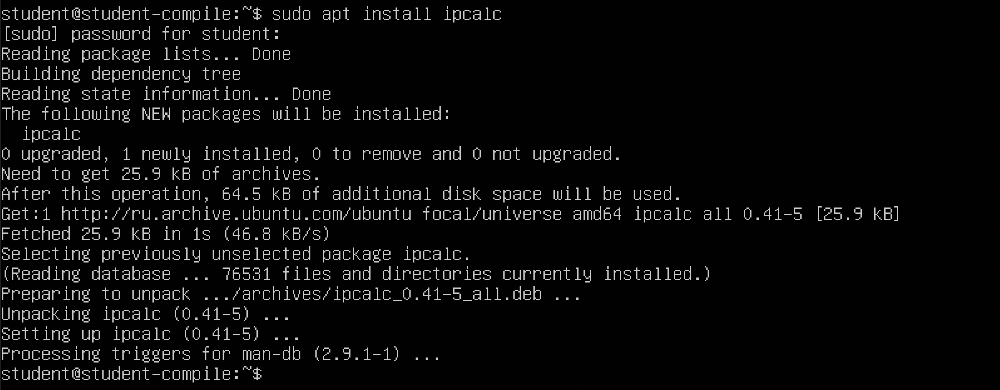

#### Subnets

One of the most useful features of `ipcalc` is its ability to calculate network segments. Here is an example of
assigning addresses 10 and 20 to two different subnets:

### 1.0 Addressing

#### IP classification

There are classifications of IP addresses as “private” and “public”. The following address ranges are reserved for
private (also known as LAN) networks:

- *10.0.0.0* — *10.255.255.255* (*10.0.0.0/8*);
- *172.16.0.0* — *172.31.255.255* (*172.16.0.0/12*);
- *192.168.0.0* — *192.168.255.255* (*192.168.0.0/16*);
- *127.0.0.0* - *127.255.255.255* (reserved for loopback interfaces (not used for communication between network nodes),
  so-called localhost).

#### Ports

The standard defines for each of the **TCP** and **UDP** protocols the ability to simultaneously allocate up to 65536
unique ports on the host, which are designated by numbers from 0 to 65535.
The entire range of ports is divided into 3 groups:

- from 0 to 1023 are called privileged or reserved (used for the system and some popular programs);
- ports from 1024 to 49151 are called registered ports;
- ports 49151 to 65535 are called dynamic ports.

### 1.1. Networks and masks

#### 1.1.1 Determine the network address *192.167.38.54/13* using the command

> ` ipcalc 192.167.38.54/13 `

#### 1.1.2 Mask translation:

> ` ipcalc 192.167.38.54/255.255.255.0 `

* prefix notation */24*
* binary form *11111111.11111111.11111111.00000000*

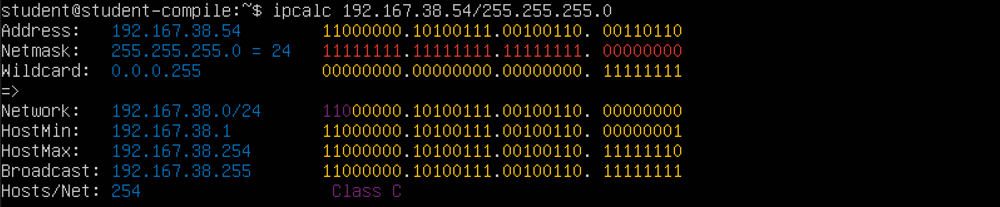

> ` ipcalc 192.167.38.54/15 `

* usual recording form *255.254.0.0*
* binary *11111111.11111110.00000000.00000000*

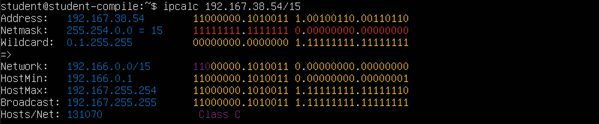

> ` ipcalc 192.167.38.54/11111111.11111111.11111111.11110000 `

* usual recording form *255.255.255.240*
* prefix */28*

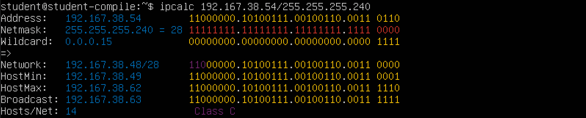

#### 1.1.3 Minimum and maximum host in the network 12.167.38.4 with masks:

> ` ipcalc 12.167.38.4/8 `

* minimum host *12.0.0.1*
* maximum host *12.255.255.254*

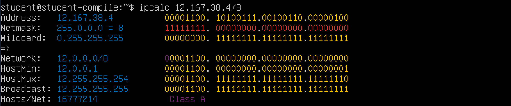

> ` ipcalc 12.167.38.4/11111111.11111111.00000000.00000000 `

equivalent

The mask prefix number is equal to the binary notation of the mask.

> ` ipcalc 12.167.38.4/16 `

* minimal host *12.167.0.1*
* maximum host *12.167.255.254*

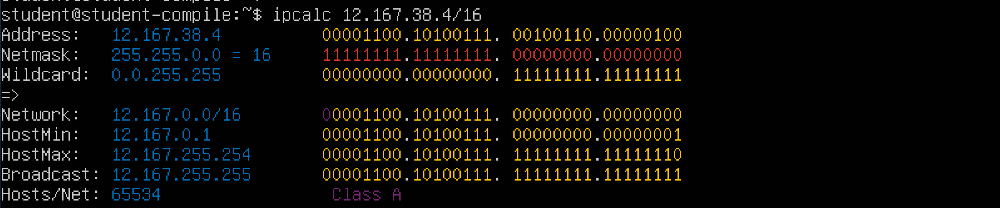

> ` ipcalc 12.167.38.4/255.255.254.0 `

equivalent

> ` ipcalc 12.167.38.4/23 `

* minimal host *12.167.38.1*
* maximum host *12.167.39.254*

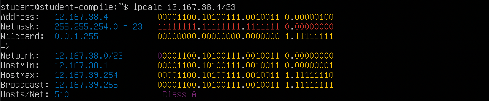

> ` ipcalc 12.167.38.4/4 `

* minimum host *0.0.0.1*
* maximum host *15.255.255.254*

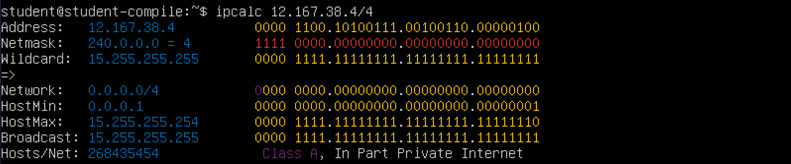

### 1.2. localhost

Determine and report whether it is possible to access an application running on localhost with the following IPs:
194.34.23.100, 127.0.0.2, 127.0.0.1, 128.0.0.1.

* applications that can be accessed via localhost: *127.0.0.2, 127.1.0.1*

> ` ipcalc 127.0.0.2 `

> ` ipcalc 127.0.0.1 `

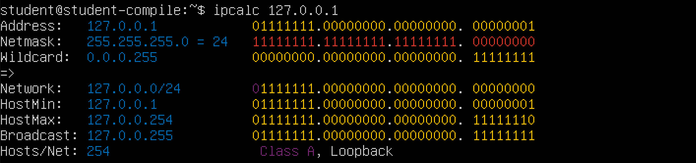

* applications that cannot be accessed via localhost: *194.34.23.100, 128.0.0.1*

> ` ipcalc 194.34.23.100 `

> ` ipcalc 128.0.0.1 `

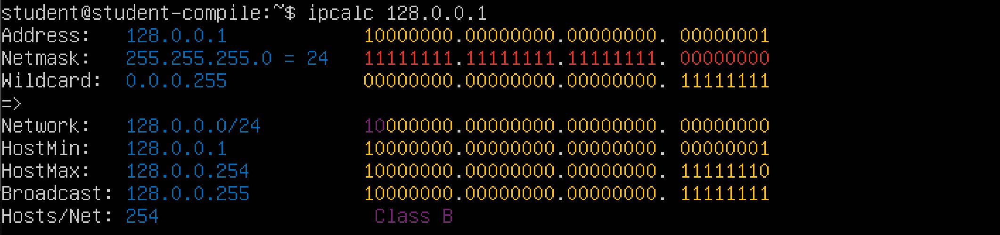

### 1.3. Network ranges and segments

#### 1.3.0 Subnets

#### 1.3.1 Determine and record in the report which of the following IPs can be used as public, and which only as private: 10.0.0.45, 134.43.0.2, 192.168.4.2, 172.20.250.4, 172.0.2.1, 192.172 .0.1, 172.68.0.2, 172.16.255.255, 10.10.10.10, 192.169.168.1.

*Public IP address* - called the IP address that is used to access the Internet.
*Private IP address* - addresses used in local networks (cannot be directly connected to the Internet).

* public IP addresses include the following: *134.43.0.2, 172.0.2.1, 192.172.0.1, 172.68.0.2, 192.169.168.1*

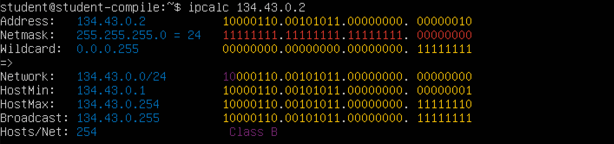
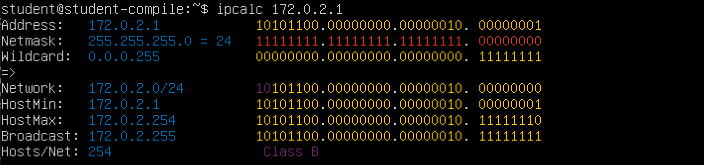
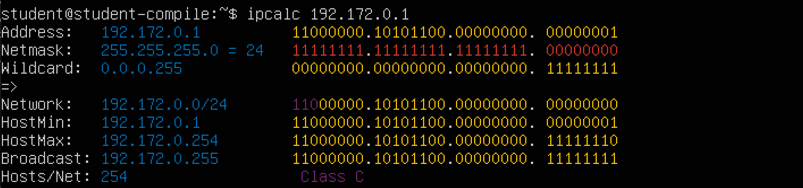
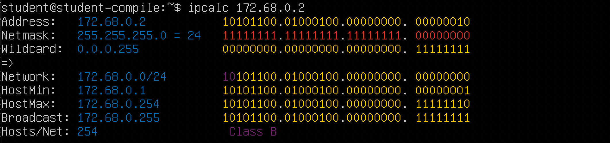
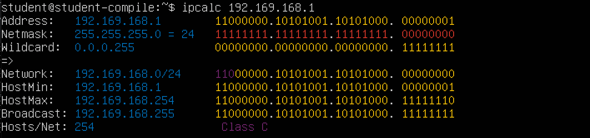

* the following IP addresses are private: *10.0.0.45, 192.168.4.2, 172.20.250.4, 172.16.255.255, 10.10.10.10*

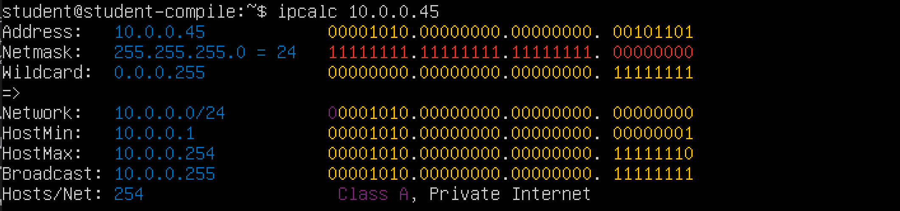
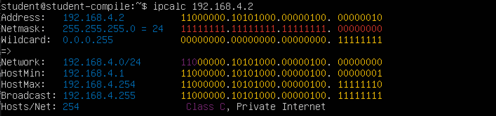
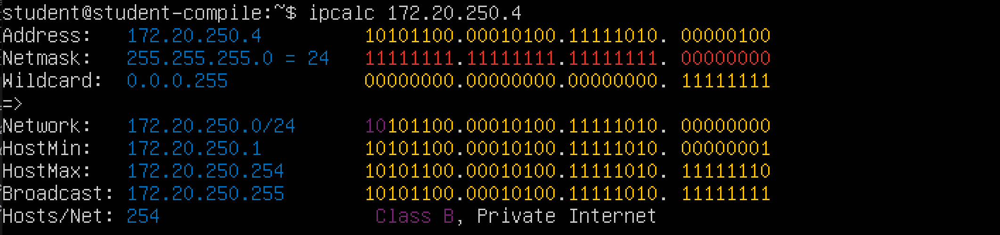
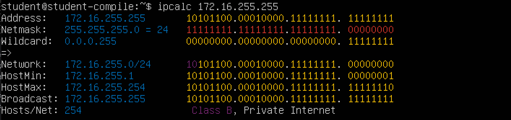
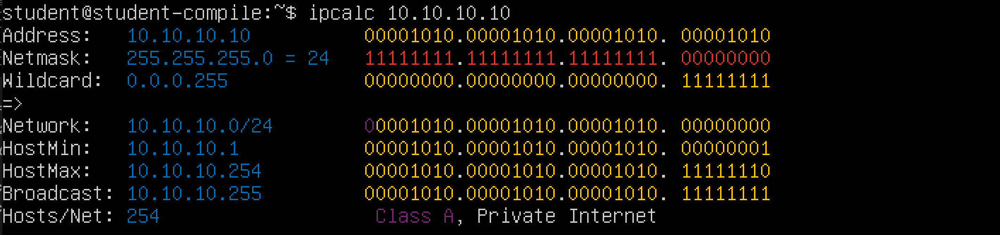

#### 1.3.2 Determine and record in the report which of the listed gateway IP addresses are possible on the 10.10.0.0/18 network: 10.0.0.1, 10.10.0.2, 10.10.10.10, 10.10.100.1, 10.10.1.255

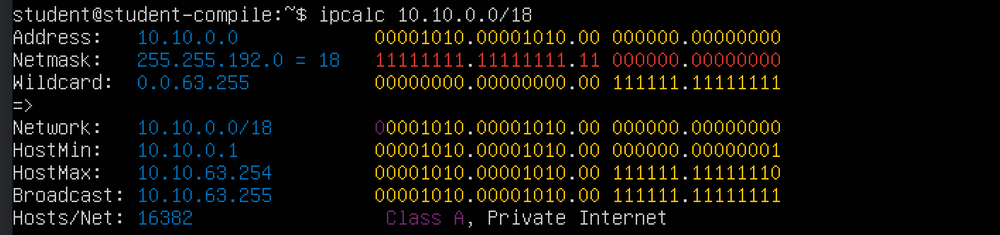

* of the listed IP addresses of gateways for network 10.10.0.0/18, the following are possible: 10.10.0.2, 10.10.10.10,
  10.10.1.255.

## Part 2. Static routing between two machines

#### 2.0.1 We raise two virtual machines ws1 and ws2.

In the settings of each machine, in the Network tab, set the connection type: Internal network.

We start both machines and set their corresponding hostnames:

- for the first car

> ` sudo hostnamectl set-hostname ws1 `

- for the second car

> ` sudo hostnamectl set-hostname ws2 `

#### 2.0.2 Using the *ip a* command we look at existing network interfaces

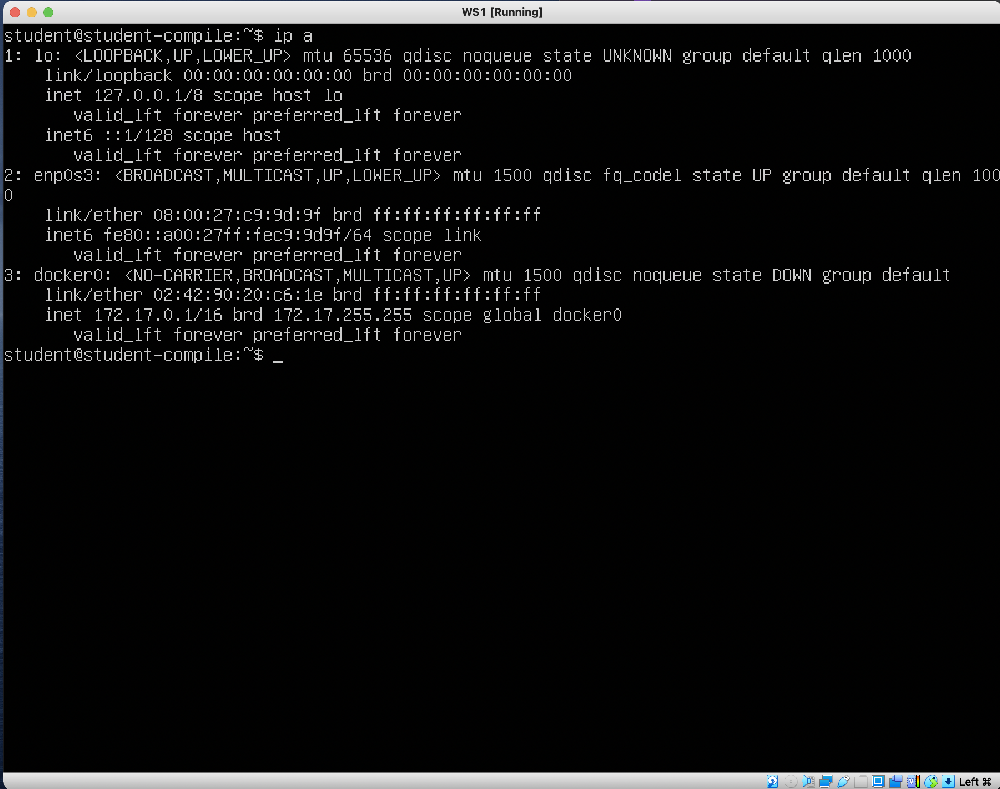
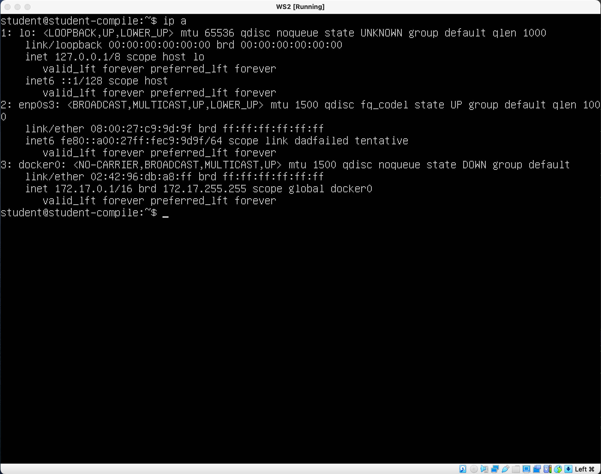

#### 2.0.3 Describe the network interface corresponding to the internal network on both machines and set the following addresses and masks: ws1 - 192.168.100.10, mask /16, ws2 - 172.24.116.8, mask /12

Using the following command (similar to the command ` ip route ` or ` ip route `) we check the addresses of the machines

> `netstat -nr`

- ` -n ` - display addresses in numeric form;
- ` -r ` - display in table form.

We use the following command to open the file and set a static address in it.

> ` sudo vim /etc/netplan/00-installer-config.yaml `

- ` etc/netplan/00-installer-config.yaml ` - a file that needs to be edited on each machine. This file is responsible
  for configuring network interfaces.

We add the corresponding lines to the files.

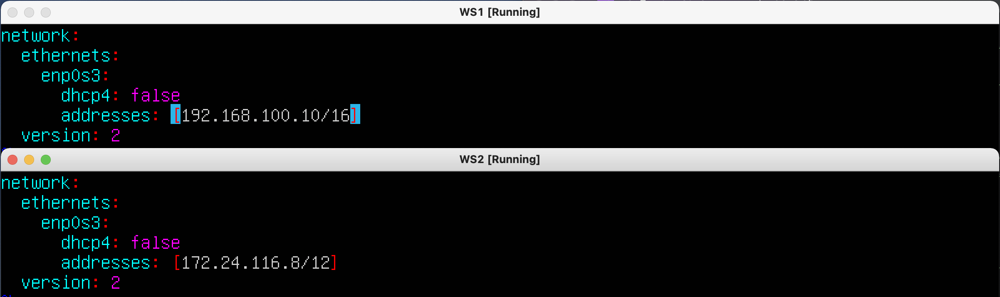

#### 2.0.4 Run the *netplan apply* command to restart the network service

> ` sudo netplan apply `

Using the following command we check the settings

> ` ip a `

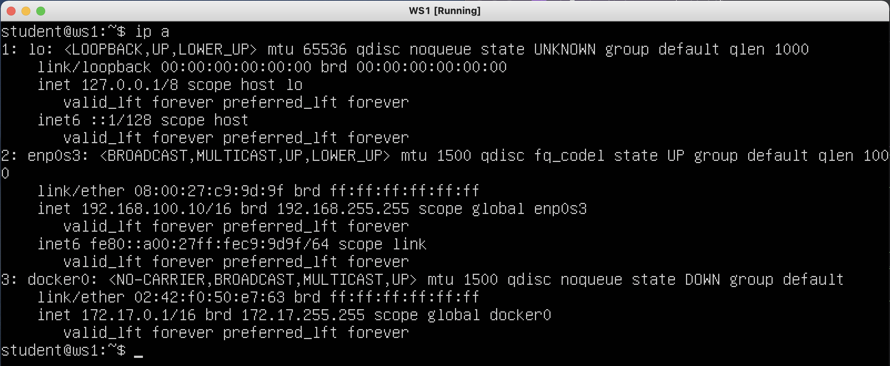
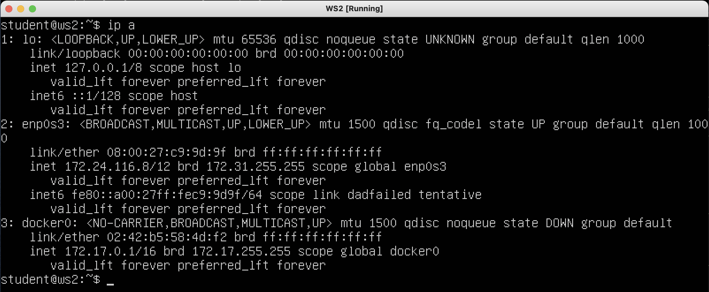

### 2.1. Adding a Static Route Manually

You can read about adding, deleting routes, etc., in
this [article](https://sysadminmosaic.ru/ip_command/ip_command "IP command").

#### 2.1.1 Add a static route from one machine to another and back

ws1
> ` sudo ip route add 172.24.116.8 dev enp0s3 `

ws2
> ` sudo ip route add 192.168.100.0 dev enp0s3 `

#### 2.1.2 Ping the connection between machines using the following command

> ` ping -c 5 <IP-address> `

- ` -c ` - indicates the number of packets.

Add a static route from one machine to another by editing the ` etc/netplan/00-installer-config.yaml ` file.

> ` sudo vim etc/netplan/00-installer-config.yaml `
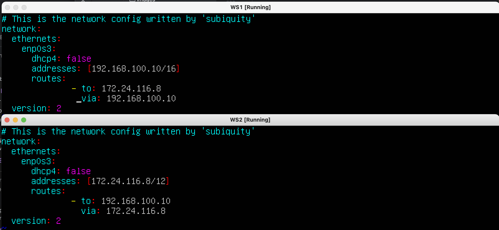

Applying new settings using the command

> ` sudo netplan apply `

Let's ping the connection between machines

> ` ping -c 5 172.24.116.8 `

> ` ping -c 5 192.168.100.10 `

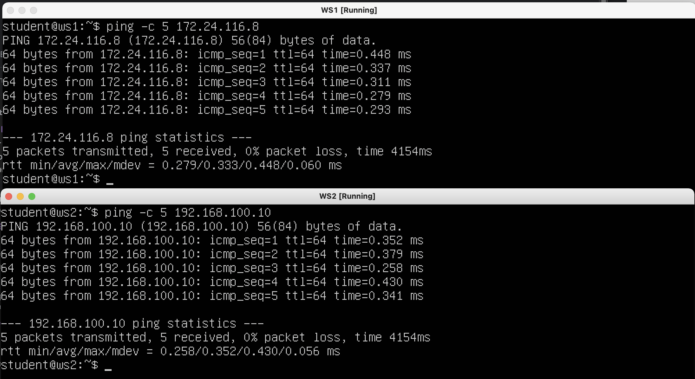

## Part 3. iperf3 utility

### 3.1. Connection speed

The basic unit of information transmission speed is bits per second (bps).
The difference between bytes per second (B/s) and bits per second (bps) is the same as the difference between bytes (B)
and bits (bits): 1 B/s = 8 bps.
Likewise, the difference between kilobytes per second (KB/s) and B/s is the same as the difference between kilobytes and
bytes: 1 KB/s = 1024 B/s. And so on.

Translate and record in the report:

* 8 Mbps (megabits per second) = 1 MB/s (megabytes per second)

* 100 MB/s (megabytes per second) = 800,000 Kbps (kilobits per second)

* 1 Gbps (gigabits per second) = 1,000 Mbps (megabits per second)

### 3.2. iperf3 utility

#### 3.2.0 Changes in VirtualBox settings so that ws1 and ws2 have access to the external network to install iperf3

Initially, VirtualBox was configured so that on virtual machines in *Configure - Network - Adapter_1 - Connection Type*
the *Internal Network* option was set, and other *Adapters* were disabled. However, this setting does not allow you to
access the Internet, download updates and install various software products.

1) Disable ` ws1 ` and ` ws2 `.
2) Go to the settings of each: ` ws ` *Networks - Adapter_1* and set *Connection type: NAT*.
3) Go immediately to *Adapter_2*, check the box *Enable network adapter*. After turning on the adapter, set *Connection
   type: Internal network*.
4) After setting up the machines ` ws1 ` and ` ws2 `, we launch them.
5) Next you need to configure ` ws2 `. To do this, edit the file ` /etc/netplan/00-installer-config.yaml `. Before that,
   let's see what the ` ws2 ` interfaces look like.
6) Configure the file ` /etc/netplan/00-installer-config.yaml `. Save
7) Accept changes to network settings and check interface settings
8) After rebooting the virtual machines, you can make sure that everything is configured correctly.
   Now you can install the necessary software packages.

#### 3.2.1 iperf3 utility: general information

**iperf3** is a cross-platform console client-server program - a TCP and UDP traffic generator for testing bandwidth in
IP networks (supports IPv4 and IPv6). With its help, it is quite easy to measure the maximum network throughput between
the server and the client and conduct load testing of the communication channel.
Since the utility has both a server and a client part, it is necessary to consider both separately.
To test your network throughput, you need to first connect to the remote machine that you will be using as a server. To
start the server (by default it will listen on port 5201) the syntax is:

> ` iperf3 -s [options] `

> ` iperf3 -s -f K `

> ` iperf3 -s -D > iperf3log `

- ` -f ` - format in which to display information (k - kbit, m - megabit, g - gigabit or K - kilobyte, M - megabyte, G -
  gigabyte);
- ` -D ` - start the server and write server messages to the log file.

### 2.1. Adding a Static Route Manually

You can read about adding, deleting routes, etc., in
this [article](https://sysadminmosaic.ru/ip_command/ip_command "IP command").

#### 2.1.1 Add a static route from one machine to another and back

ws1
> ` sudo ip route add 172.24.116.8 dev enp0s3 `

ws2
> ` sudo ip route add 192.168.100.0 dev enp0s3 `

#### 2.1.2 Ping the connection between machines using the following command

> ` ping -c 5 <IP-address> `

- ` -c ` - indicates the number of packets.

Add a static route from one machine to another by editing the ` etc/netplan/00-installer-config.yaml ` file.

> ` sudo vim etc/netplan/00-installer-config.yaml `

Applying new settings using the command

> ` sudo netplan apply `

Let's ping the connection between machines

> ` ping -c 5 172.24.116.8 `

> ` ping -c 5 192.168.100.10 `

## Part 3. iperf3 utility

### 3.1. Connection speed

The basic unit of information transmission speed is bits per second (bps).
The difference between bytes per second (B/s) and bits per second (bps) is the same as the difference between bytes (B)
and bits (bits): 1 B/s = 8 bps.
Likewise, the difference between kilobytes per second (KB/s) and B/s is the same as the difference between kilobytes and
bytes: 1 KB/s = 1024 B/s. And so on.

Translate and record in the report:

* 8 Mbps (megabits per second) = 1 MB/s (megabytes per second)

* 100 MB/s (megabytes per second) = 800,000 Kbps (kilobits per second)

* 1 Gbps (gigabits per second) = 1,000 Mbps (megabits per second)

### 3.2. iperf3 utility

#### 3.2.0 Changes in VirtualBox settings so that ws1 and ws2 have access to the external network to install iperf3

Initially, VirtualBox was configured so that on virtual machines in *Configure - Network - Adapter_1 - Connection Type*
the *Internal Network* option was set, and other *Adapters* were disabled. However, this setting does not allow you to
access the Internet, download updates and install various software products.

1) Disable ` ws1 ` and ` ws2 `.
2) Go to the settings of each: ` ws ` *Networks - Adapter_1* and set *Connection type: NAT*.
3) Go immediately to *Adapter_2*, check the box *Enable network adapter*. After turning on the adapter, set *Connection
   type: Internal network*.
4) After setting up the machines ` ws1 ` and ` ws2 `, we launch them.
5) Next you need to configure ` ws2 `. To do this, edit the file ` /etc/netplan/00-installer-config.yaml `. Before that,
   let's see what the ` ws2 ` interfaces look like.
6) Configure the file ` /etc/netplan/00-installer-config.yaml `. Save
7) Accept changes to network settings and check interface settings
8) After rebooting the virtual machines, you can make sure that everything is configured correctly.
   Now you can install the necessary software packages.

#### 3.2.1 iperf3 utility: general information

**iperf3** is a cross-platform console client-server program - a TCP and UDP traffic generator for testing bandwidth in
IP networks (supports IPv4 and IPv6). With its help, it is quite easy to measure the maximum network throughput between
the server and the client and conduct load testing of the communication channel.
Since the utility has both a server and a client part, it is necessary to consider both separately.
To test your network throughput, you need to first connect to the remote machine that you will be using as a server. To
start the server (by default it will listen on port 5201) the syntax is:

> ` iperf3 -s [options] `

> ` iperf3 -s -f K `

> ` iperf3 -s -D > iperf3log `

- ` -f ` - format in which to display information (k - kbit, m - megabit, g - gigabit or K - kilobyte, M - megabyte, G -
  gigabyte);
- ` -D ` - start the server and write server messages to the log file.

Then, on the local computer that is being treated as a client, you need to run **iperf3** in client mode using the *-c*
flag, and specify the host on which the server is running (using either its IP address, domain, or hostname ).

> ` iperf3 -c [server_address] [options] `

> ` iperf3 -c 192.168.10.1 -f K `

#### 3.2.2 Let's measure the connection speed between ws1 and ws2 using the iperf3 utility

The ` iperf3 ` utility is installed using the command

> ` sudo apt install iperf3 `

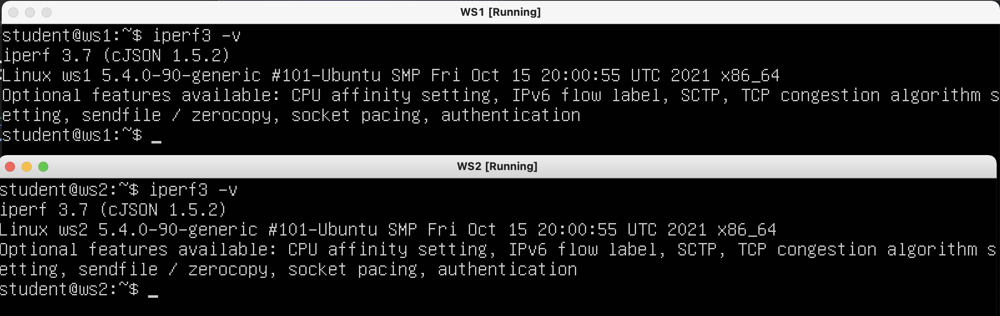

Installation and access to the Internet may require a system update, which can be done using the command.

> ` sudo apt update & upgrade `

We launch the utility on ` ws1 ` in server mode with the ` -s ` flag. It will wait until the utility starts on ` ws2 `
in client mode.

> ` iperf3 -s `

Next, run the utility on ` ws2 ` in client mode with the ` -c ` flag and specify the IP address of ` ws1 `.

> ` iperf3 -c 192.168.100.10 `

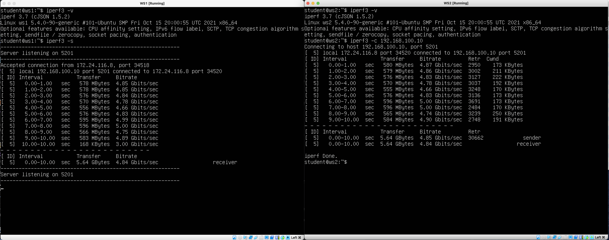

## Part 4. Firewall

[Firewall or Firewall] "What is a firewall?" is a set of software or hardware that allows filtering and monitoring of
packets passing through it in accordance with pre-specified parameters.
The main task of a firewall is to protect computer networks or specific nodes from access by intruders. Firewalls are
often called filters, which is due to their main task - to filter packets that do not meet the criteria defined in the
configuration.

### 4.1. iptables utility

**iptables** is a command line firewall utility that uses policy chains to allow or block traffic. When a connection
tries to be established on the system, `iptables` looks for a rule in its list to match. If the utility does not find
the required rule, it resorts to the default action.

The `iptables` and Netfilter subsystems have been built into the Linux kernel for quite some time. All network packets
that pass through the computer, are sent by the computer, or are destined for the computer, are routed by the kernel
through the `iptables` filter. There, these packages can be checked and then for each check, if it is passed, the action
specified in it is performed. For example, the packet is passed on to the kernel to be sent to the target program, or is
discarded.

Go to the root directory

> `cd`

Create a file ` /etc/firewall.sh `, simulating a firewall, on ` ws1 ` and ` ws2 ` using the command

> ` sudo touch /etc/firewall.sh `

Add the following rules to the file according to the task:

> ` sudo vim /etc/firewall.sh `

1) on ` ws1 ` apply a strategy where a prohibiting rule is written at the beginning, and an allowing rule is written at
   the end (this applies to points 4 and 5).

2) on ` ws2 ` apply a strategy where an allowing rule is written at the beginning, and a prohibiting rule is written at
   the end (this applies to points 4 and 5).

3) open access on the machines to port 22 (ssh) and port 80 (http).

4) disable *echo reply* (the machine should not “ping”, i.e. there should be a blocking on OUTPUT).

5) allow *echo reply* (the machine must “ping”).

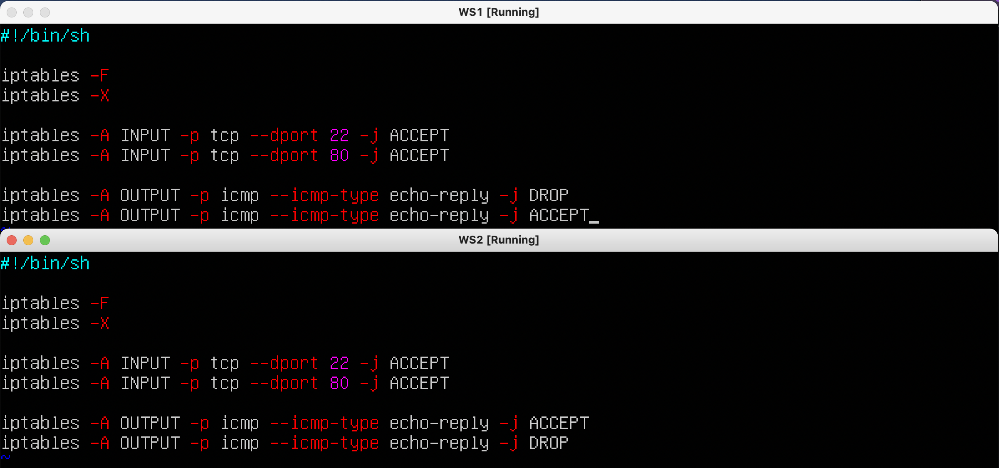

Let's run the files on both machines using the commands

> ` sudo chmod +x /etc/firewall.sh `

> ` sudo bash /etc/firewall.sh `

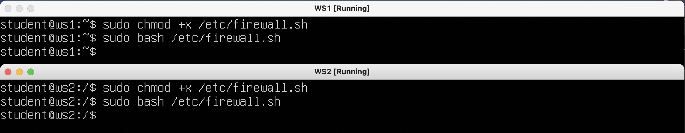

The difference between the strategies applied in the first and second files is as follows: in the `iptables` utility,
the rules are executed from top to bottom.
The first machine has a deny exit rule specified first, so it will not be able to ping another machine. The second
machine, on the contrary, has the allowing rule listed first, which means it will be able to ping another machine.

Let's ping the connection between machines

### 4.2. nmap utility

**nmap** is a very popular network scanner for network exploration and security auditing. It is open source and can be
used on both Windows and Linux.

This program helps system administrators very quickly understand which computers are connected to the network, find out
their names, and also see what software is installed on them, what operating system and what types of filters are used.

This tool is commonly used by hackers and cybersecurity enthusiasts, as well as network and system administrators.
It is used for the following purposes:

- information about the network in real time;
- detailed information about all IP addresses activated on your network;
- number of open ports on the network;
- provide a list of live hosts;
- scanning ports, OS and hosts;
- see the types of filters used.
  For example, scripts can be used to automatically detect new security vulnerabilities on the network.
  The most common use of ` nmap ` is to scan a system by hostname or IP address.
  One of the features of ` nmap ` is that this utility can determine whether a host is up even if it cannot be pinged.

#### 4.2.1 Finding a machine that does not “ping”

> ` ping -c 5 172.24.116.8 `
>
> ` ping -c 5 192.168.100.10 `

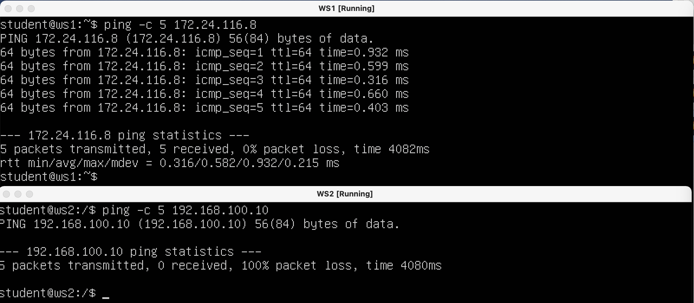

In the ` firewall.sh ` file for the first machine, the deny rule was specified first, so it does not ping. To check to
show that the host of the machine is running, we will use the ` nmap ` utility.
Let's install the ` nmap ` utility using the following command. During installation, a request will appear, you will
need to agree.

> ` sudo apt install nmap `

We launch the ` nmap ` utility with the command (to check, look for the presence of the line ***Host is up*** in
the ` nmap ` output)

> ` sudo nmap IP-address `

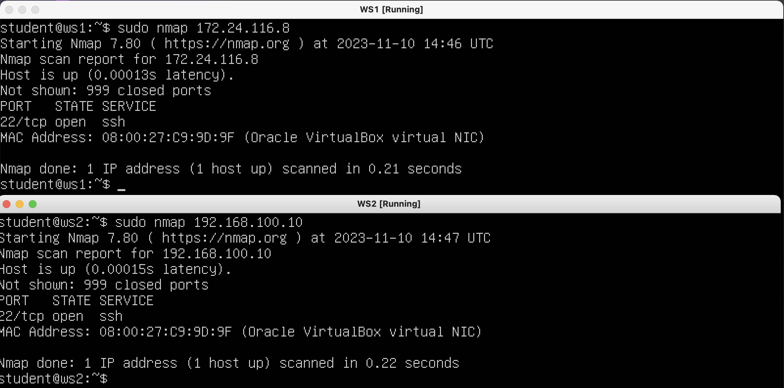

#### 4.2.2 Save dumps of virtual machine images.

To [save machine images](https://comphome.ru/virtualbox-virtualnaja-mashina/kak-sohranit-sostojanie-virtualnoj-mashiny-virtualbox.html "How to save VM state in VirtualBox")
in the machine settings select *Options - Pictures*.

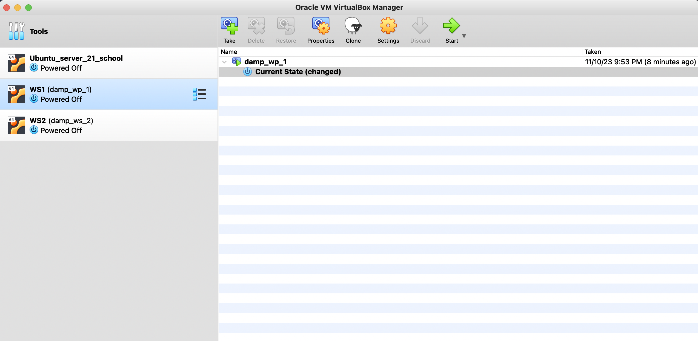
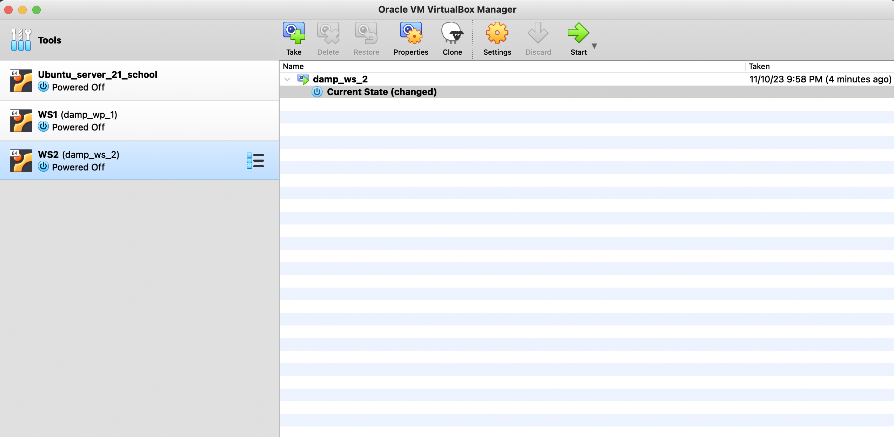

## Part 5. Static network routing

We raise five virtual machines (3 workstations (ws11, ws21, ws22) and 2 routers (r1, r2))
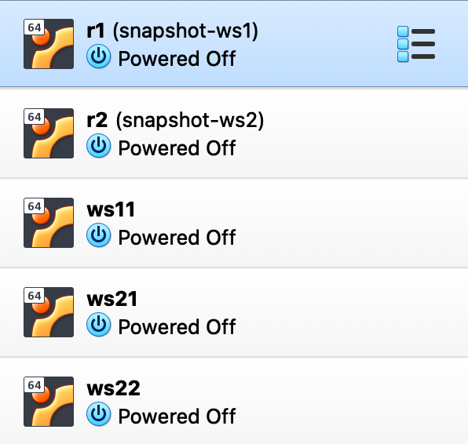

### 1. Setting up machine addresses

Configure machine configurations in etc/netplan/00-installer-config.yaml according to the network in the figure:

- contents of the file `etc/netplan/00-installer-config.yaml` for the machine **ws11**:
  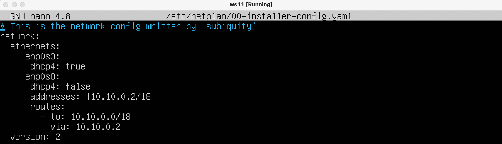
- contents of the file `etc/netplan/00-installer-config.yaml` for machine **r1**:
  
- contents of the file `etc/netplan/00-installer-config.yaml` for machine **r2**:
  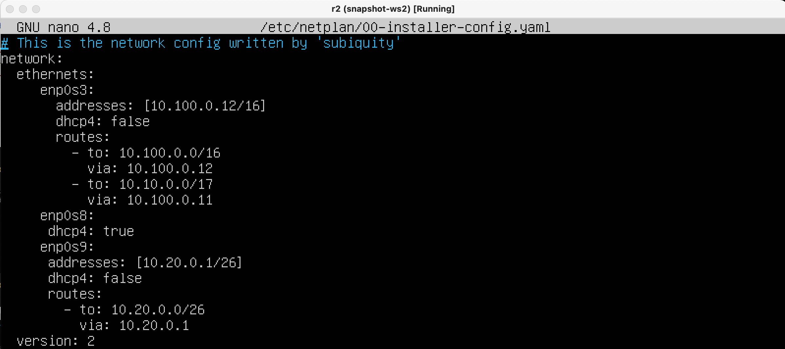 [Title](LinuxNetwork_report.md)
- contents of the file `etc/netplan/00-installer-config.yaml` for the machine **ws21**:
  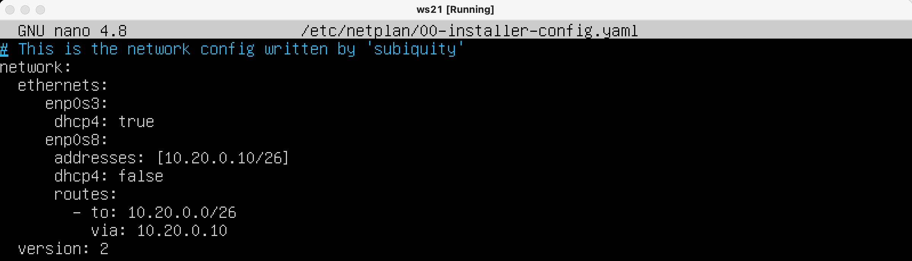
- contents of the file `etc/netplan/00-installer-config.yaml` for the machine **ws22**:
  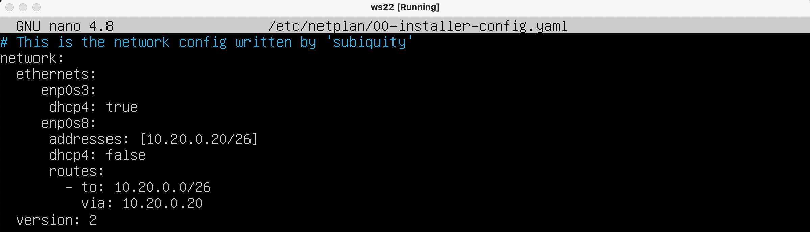

Let's restart the network service and use the command `ip -4 a` to check that the machine address is set correctly:

- car **ws11**:
  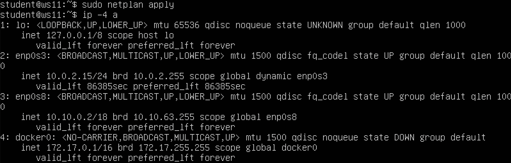
- machine **r1**:
  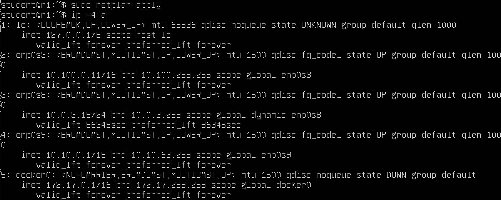
- machine **r2**:
  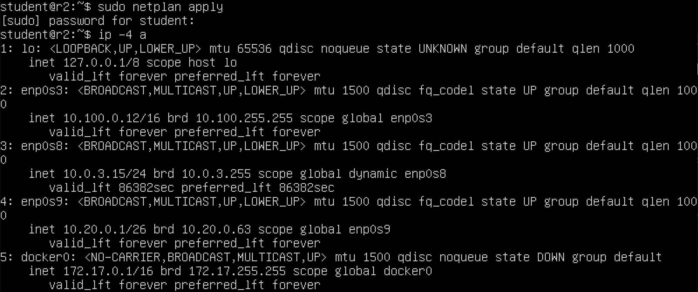
- car **ws21**:
  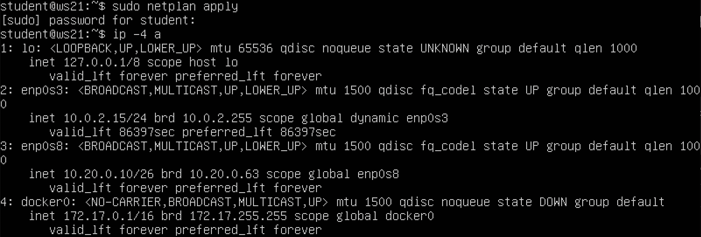
- car **ws22**:
  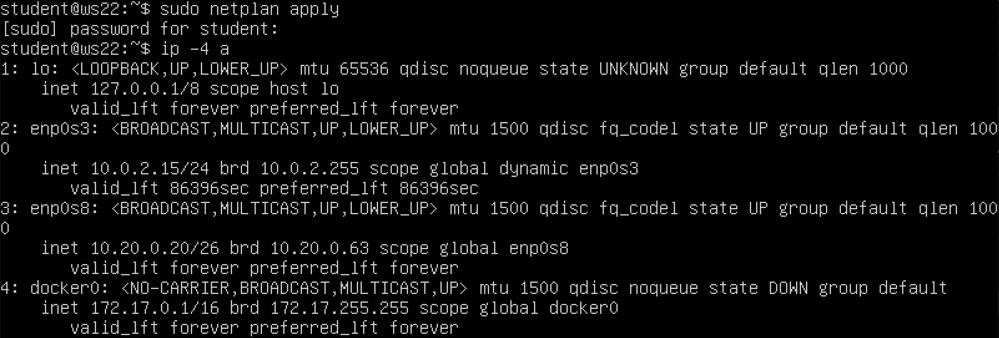

Let's ping **ws22** from **ws21**:
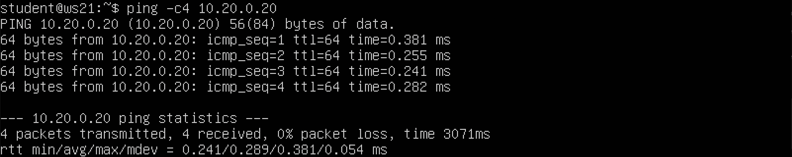
Let's ping **r1** from **ws11** in the same way:
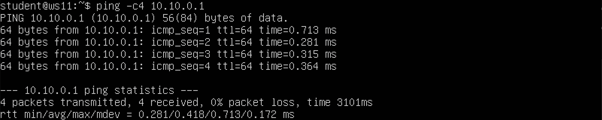

### 2. Enable IP forwarding

To enable IP forwarding, run the command on routers `sysctl -w net.ipv4.ip_forward=1`

- router **r1**:
  
- router **r**:
  

Next, open the file `/etc/sysctl.conf` and add the following line to it: **net.ipv4.ip_forward = 1**

- router **r1**:
  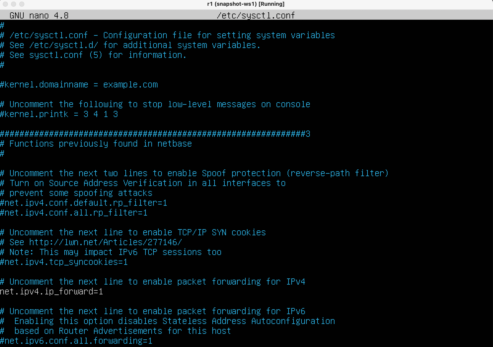
- router **r2**:
  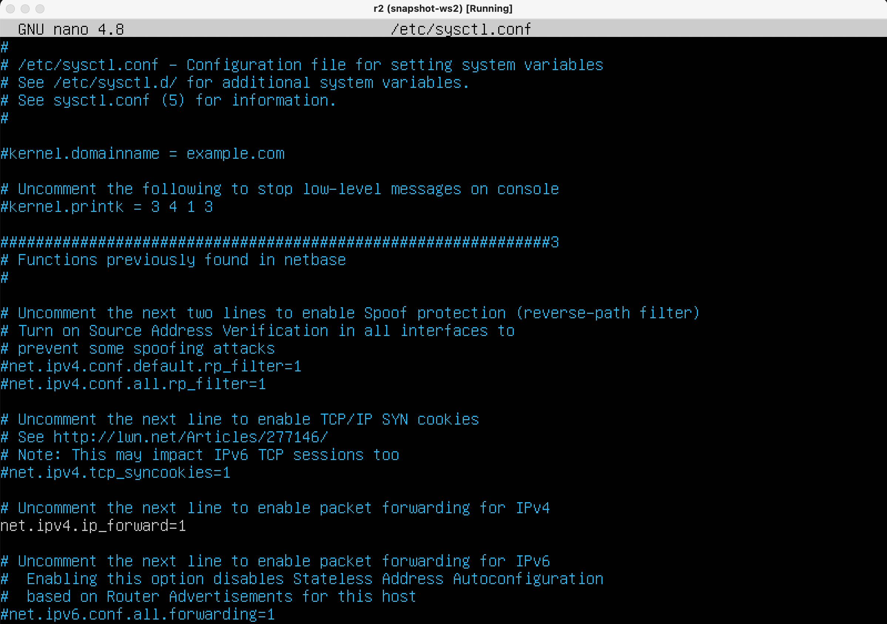

### 3. Setting the default route

Let's configure the default route (gateway) for workstations
To do this, add **default** before the router IP in the configuration file

- car **ws11**:
  
- car **ws21**:
  
- car **ws22**:
  
  Call `ip r` to indicate that a route has been added to the routing table:
- car **ws11**:
  
- car **ws21**:
  
- car **ws22**:
  

Let's ping router **r2** from machine **ws11**:

In order to check that ping is going through, use the command: `sudo tcpdump -tn -i enp0s9 -c4`


### 4. Adding static routes

Let's add static routes to routers r1 and r2 in the configuration file:

- router **r1**:
  
- router **r1**:
  

Call `ip r` to show the route tables on both routers:

- router **r1**:
  
- router **r1**:
  

Let's run the commands on ws11: `ip r list 10.10.0.0/[network mask]` and `ip r list 0.0.0.0/0`:

For the address 10.10.0.0/18, a route other than 0.0.0.0/0 was chosen, although it falls under the default route,
because the router considers routes with the highest mask to have higher priority, so the route with mask /0 is the most
recent priority

### 5. Building a list of routers

Let's run the dump command on **r1**: `tcpdump -tnv -i enp0s9`

Using the command `sudo traceroute 10.20.0.10` we will build a list of routers on the path from **ws11** to **ws21**:

To identify intermediate routers, **traceroute** sends a series of ICMP packets to the target host (3 packets by
default), increasing the TTL field value by 1 with each step. The first series of packets is sent with a TTL of 1, and
therefore, the first router returns an ICMP “time exceeded in transit” message, indicating the impossibility of data
delivery. Traceroute records the router's address, as well as the time between sending the packet and receiving the
response (this information is displayed on the computer monitor). Traceroute then resends a series of packets, but with
a TTL of 2, which causes the first router to decrement the TTL of the packets by one and forward them to the second
router. The second router, having received packets with TTL=1, also returns “time exceeded in transit”

### 6. Using ICMP for routing

Run on **r1** intercepting network traffic passing through eth0 using the command: `sudo tcpdump -n -i eth0s8 icmp`

Let's ping a non-existent IP (for example, 10.30.0.111) from **ws11** using the command: `ping -c4 10.30.0.111`

Let's save image dumps of virtual machines:


## Part 6. Dynamic IP configuration using DHCP

For **r2**, configure the DHCP service configuration in the /etc/dhcp/dhcpd.conf file:

- install the utilities we need to get the **dhcpd.conf** file: `sudo apt install isc-dhcp-server`
  and `sudo apt install resolvconf`
- specify the default router address, DNS server and internal network address in the /etc/dhcp/dhcpd.conf file:
  
- in the resolv.conf file write `nameserver 8.8.8.8`
  
- restart the DHCP service with the command `sudo systemctl restart isc-dhcp-server`
  
- reboot the **ws21** machine using `reboot` and show through `ip a` that it has received the address:
  
- ping **ws22** from **ws21**:
  

Let's specify the MAC address of **ws11**, to do this in etc/netplan/00-installer-config.yaml add the
lines: `macaddress: 10:10:10:10:10:BA` and `dhcp4: true`:

For **r1** we will configure **r2** in the same way, but we will issue addresses with a strict binding to the MAC
address (ws11):

- install DHCP on **r1** with the command `sudo apt install isc-dhcp-server`
- edit the file /etc/dhcp/dhcpd.conf on **r1**:
  
- edit the resolv.conf file on **r1**:
  
- restart the DHCP service with the command `sudo systemctl restart isc-dhcp-server`
  
- reboot **ws11** using `reboot` and show through `ip a` that it has received the address:
  
- in the settings of the machine **ws11** we will write the MAC Address:
  
- Let's conduct similar tests:
  

Let's request an IP address update from **ws21**:

- IP before update:
  
- delete old addresses `sudo dhclient -r` and get new ones `sudo dhclient`
  
- **DHCP** options we use:
    - **subnet** – network in which the settings will work;
    - **netmask** - subnet mask;
    - **range** – range of IP addresses;
    - **option routers** – default gateway;
    - **option domain-name-servers** – DNS servers;
    - **host** - binding to MAC address

Let's save image dumps of virtual machines:


## Part 7. NAT

In the /etc/apache2/ports.conf file on and **r1** we will change the line `Listen 80` to `Listen 0.0.0.0:80`, that is,
we will make the Apache2 server public:

- router **r1**
  
- car **ws22**
  

Let's start the Apache web server with the command `service apache2 start` on **ws22** and **r1**:

- car **ws22**
  
- router **r1**
  

We add the following rules to the firewall, created by analogy with the firewall from Part 4, on **r2**:

1) Removing rules in the table `filter - iptables -F`
2) Removing rules in the "NAT" table - `iptables -F -t nat`
3) Drop all routed packets - `iptables --policy FORWARD DROP`


Let's run and check:


Check the connection between **ws22** and **r1** with the `ping` command. When running a file with these rules, **ws22**
should not ping with **r1**:

Add one more rule to the file:

4. allow routing of all ICMP protocol packets:
   

Let's run it and check:

Check the connection between **ws22** and **r1** with the `ping` command. When running a file with these rules, **ws22**
should ping with **r1**:

Let's add two more rules to the file:

5. Enable **SNAT**, namely masking all local ips from the local network located behind **r2** (according to the notation
   from Part 5 - network 10.20.0.0)

6. Enable **DNAT** on port 8080 of machine **r2** and add access from outside the network to the Apache web server
   running on **ws22**
   

And let's start the system:

Disable the **NAT** network interface (check with the `ip a` command) in VirtualBox

The screenshot shows that there is no adapter **enp0s8**, which was responsible for the Internet

We check the TCP connection for SNAT; to do this, connect to the Apache server on **r1** from **ws22** with the command:
`telnet [address] [port]`

Check the TCP connection for DNAT; to do this, from **r1** connect to the Apache server on **ws22** with the `telnet`
command (use the address **r2** and port 8080)

## Part 8. Additionally. Introducing SSH Tunnels

Let's launch a firewall on **r2** with the rules from Part 7:

Let's use Local TCP forwarding from **ws21** to **ws22** to access the web server on **ws22** with **ws21
** `sudo ssh -L 8080:localhost:80 student@10.20. 0.20`:

Let's use Remote TCP forwarding from **ws11** to **ws22** to access the web server on **ws22** from **ws11
** `sudo ssh -R 8080:localhost:80 student@10.20. 0.20`:

To check if the connection worked in both previous steps, go to the second terminal (for example, using the fn +
option + F2 keys) and run the command:
`telnet 127.0.0.1 [local port]`

