## Part 1. Инструмент ipcalc

**ipcalc** — это утилита, которая может выполнять простые манипуляции с адресами IPv4.
Если вы просто наберете ` ipcalc ` без каких-либо параметров ввода, это даст хороший вывод «справки» с некоторыми
примерами, которые очень полезны для начала работы.

Инструмент ` ipcalc ` можно применять для следующих задач:

- проверить IP-адрес;
- показать рассчитанный широковещательный адрес;
- отображение имени хоста, определенного через DNS;
- отображение сетевого адреса или префикса.

Для установки утилиты ` ipcalc ` следует ввести следующую команду:

> ` sudo apt install ipcalc `

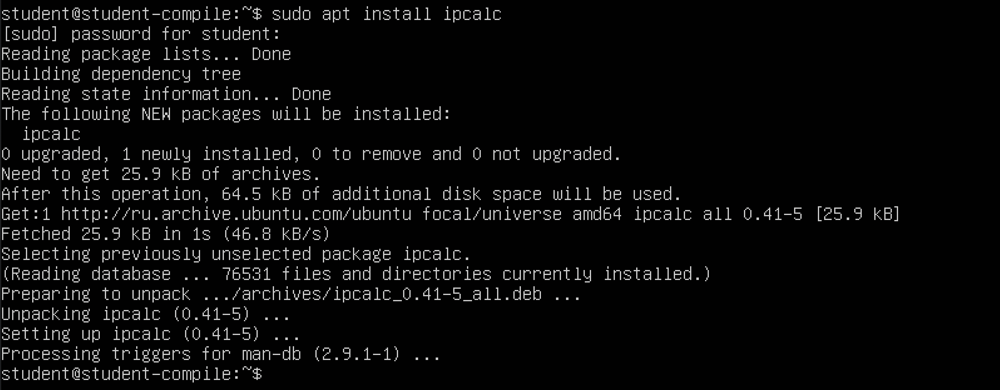

#### Подсети (Subnets)

Одной из наиболее полезных возможностей ` ipcalc ` является его способность вычислять сегменты сети. Вот пример
назначения адреса 10 и 20 двум разным подсетям:

### 1.0 Адресация

#### IP-классификация

Существуют классификации IP-адресов как «частные» и «публичные». Следующие диапазоны адресов зарезервированы для
частных (также известных как LAN) сетей:

- *10.0.0.0* — *10.255.255.255* (*10.0.0.0/8*);
- *172.16.0.0* — *172.31.255.255* (*172.16.0.0/12*);
- *192.168.0.0* — *192.168.255.255* (*192.168.0.0/16*);
- *127.0.0.0* — *127.255.255.255* (зарезервировано для петлевых интерфейсов (не используется для связи между узлами
  сети), так называемый localhost).

#### Порты

Стандарт определяет для каждого из протоколов **TCP** и **UDP** возможность одновременного выделения до 65536 уникальных
портов на хосте, которые обозначаются номерами от 0 до 65535.
Весь ассортимент портов разбит на 3 группы:

- от 0 до 1023 называются привилегированными или зарезервированными (используются для системы и некоторых популярных
  программ);
- порты с 1024 по 49151 называются зарегистрированными портами;
- порты с 49151 по 65535 называются динамическими портами.

### 1.1. Сети и маски

#### 1.1.1 Определяем адрес сети *192.167.38.54/13* с помощью команды

> ` ipcalc 192.167.38.54/13 `

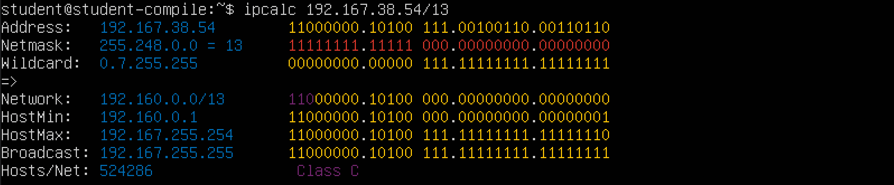

#### 1.1.2 Перевод маски:

> ` ipcalc 192.167.38.54/255.255.255.0 `

* префиксная форма записи */24*
* двоичная форма записи *11111111.11111111.11111111.00000000*

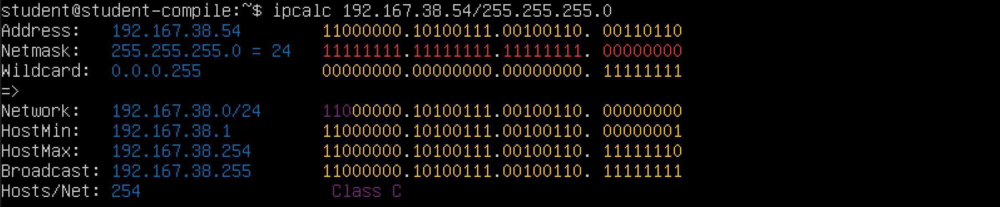

> ` ipcalc 192.167.38.54/15 `

* обычная форма записи *255.254.0.0*
* двоичная *11111111.11111110.00000000.00000000*

> ` ipcalc 192.167.38.54/11111111.11111111.11111111.11110000 `

* обычная форма записи *255.255.255.240*
* префиксная */28*

#### 1.1.3 Минимальный и максимальный хост в сети 12.167.38.4 при масках:

> ` ipcalc 12.167.38.4/8 `

* минимальный хост *12.0.0.1*
* максимальный хост *12.255.255.254*

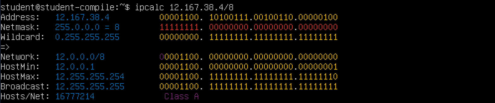

> ` ipcalc 12.167.38.4/11111111.11111111.00000000.00000000 `

эквивалентно

число префикса маски равно двоичной записи маски.

> ` ipcalc 12.167.38.4/16 `

* минимальный хост *12.167.0.1*
* максимальный хост *12.167.255.254*

> ` ipcalc 12.167.38.4/255.255.254.0 `

эквивалентно

> ` ipcalc 12.167.38.4/23 `

* минимальный хост *12.167.38.1*
* максимальный хост *12.167.39.254*

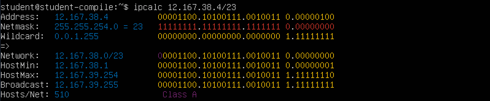

> ` ipcalc 12.167.38.4/4 `

* минимальный хост *0.0.0.1*
* максимальный хост *15.255.255.254*

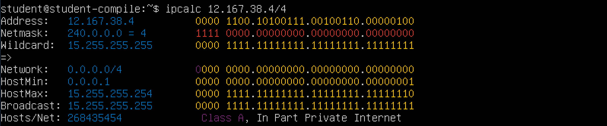

### 1.2. localhost

Определить и записать в отчёт, можно ли обратиться к приложению, работающему на localhost, со следующими IP:
194.34.23.100, 127.0.0.2, 127.0.0.1, 128.0.0.1 .

* приложения к которым можно обратиться через localhost: *127.0.0.2, 127.1.0.1*

> ` ipcalc 127.0.0.2 `

> ` ipcalc 127.0.0.1 `

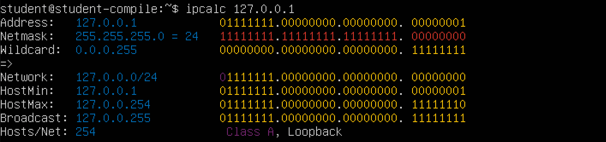

* приложения к которым нельзя обратиться через localhost: *194.34.23.100, 128.0.0.1*

> ` ipcalc 194.34.23.100 `

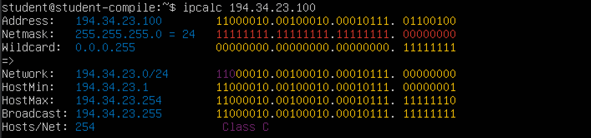

> ` ipcalc 128.0.0.1 `

### 1.3. Диапазоны и сегменты сетей

#### 1.3.0 Подсети (Subnets)

#### 1.3.1 Определить и записать в отчёт какие из перечисленных IP можно использовать в качестве публичного, а какие только в качестве частных: 10.0.0.45, 134.43.0.2, 192.168.4.2, 172.20.250.4, 172.0.2.1, 192.172.0.1, 172.68.0.2, 172.16.255.255, 10.10.10.10, 192.169.168.1.

*Публичный IP адрес* - называется IP адрес, который используется для выхода в Интернет.
*Частный IP адрес* - адреса, используемые в локальных сетях (не может быть напрямую подключен к Интернету).

* к публичным относятся следующие IP адреса: *134.43.0.2, 172.0.2.1, 192.172.0.1, 172.68.0.2, 192.169.168.1*

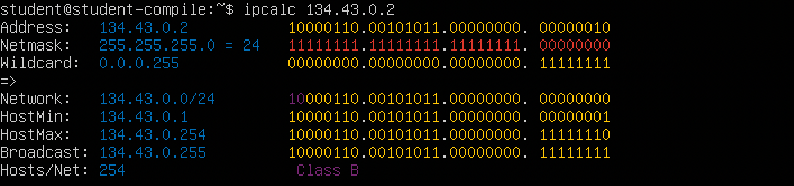
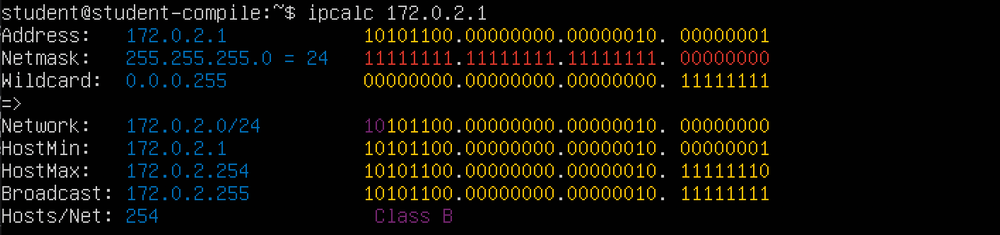

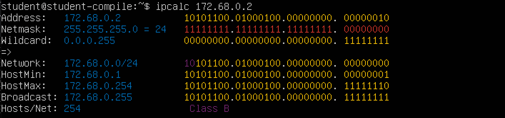

* к частным относятся следующие IP адреса: *10.0.0.45, 192.168.4.2, 172.20.250.4, 172.16.255.255, 10.10.10.10*

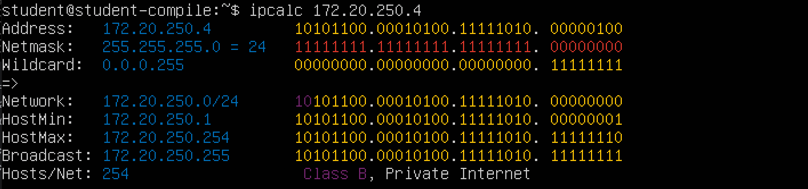

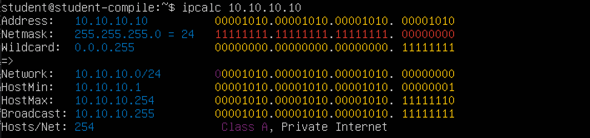

#### 1.3.2 Определить и записать в отчёт какие из перечисленных IP адресов шлюза возможны у сети 10.10.0.0/18: 10.0.0.1, 10.10.0.2, 10.10.10.10, 10.10.100.1, 10.10.1.255

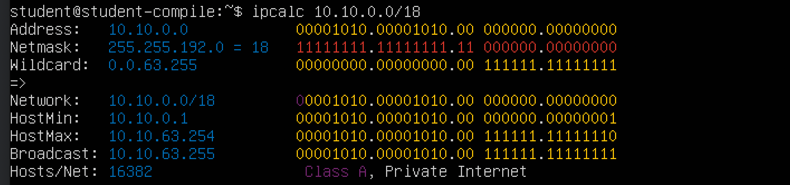

* из перечисленных IP адресов шлюзов у сети 10.10.0.0/18 возможны следующие: 10.10.0.2, 10.10.10.10, 10.10.1.255 .

## Part 2. Статическая маршрутизация между двумя машинами

#### 2.0.1 Поднимаем две виртуальные машины  ws1 и ws2.

В настройках каждой машины во вкладке Сеть задаем Тип подключения: Внутренняя сеть.

Запускаем обе машины и устанавливаем им соответствующие имена хоста:

- для первой машины

> ` sudo hostnamectl set-hostname ws1 `

- для второй машины

> ` sudo hostnamectl set-hostname ws2 `

#### 2.0.2 С помощью команды *ip a* смотрим существующие сетевые интерфейсы

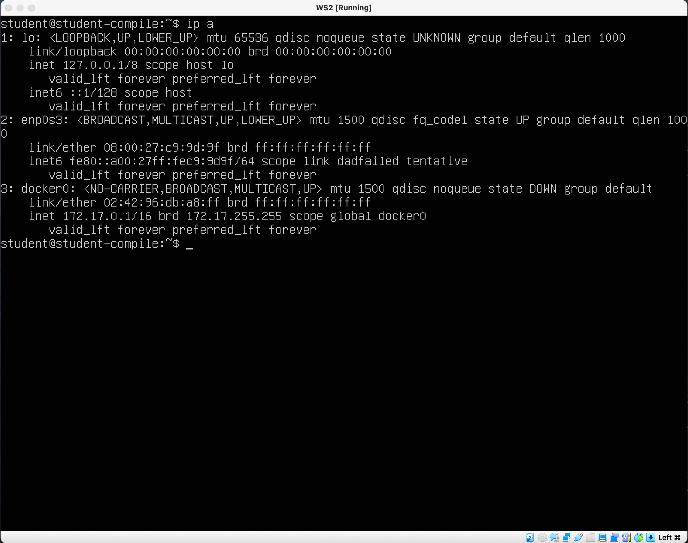

#### 2.0.3 Описать сетевой интерфейс, соответствующий внутренней сети, на обеих машинах и задать следующие адреса и маски: ws1 - 192.168.100.10, маска /16, ws2 - 172.24.116.8, маска /12

С помощью следующей команды (аналогичная команда ` ip route `  или ` ip route `) проверяем адреса машин

> ` netstat -nr `

- ` -n ` - отбражение адресов в числовом виде;
- ` -r ` - отображение в виде таблицы.

Используем следующую команду для открытия файла и установки в нём статического адреса.

> ` sudo vim /etc/netplan/00-installer-config.yaml `

- ` etc/netplan/00-installer-config.yaml ` - файл который нужно отредактировать на каждой машине. Этот файл отвечает за
  настройку интерфейсов сети.

Дописываем в файлы соответствующие строки.

#### 2.0.4 Выполним команду *netplan apply* для перезапуска сервиса сети

> ` sudo netplan apply `

С помощью следующей команды перепроверяем настройки

> ` ip a `

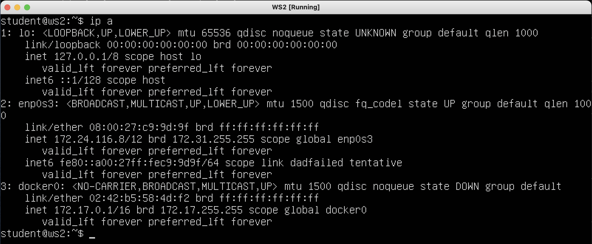

### 2.1. Добавление статического маршрута вручную

Прочесть про добавление, удаление маршрутов и т.д., можно в
этой [статье](https://sysadminmosaic.ru/ip_command/ip_command "Команда ip").

#### 2.1.1 Добавим статический маршрут от одной машины до другой и обратно

ws1
> ` sudo ip route add 172.24.116.8 dev enp0s3 `

ws2
> ` sudo ip route add 192.168.100.0 dev enp0s3 `

#### 2.1.2 Пропингуем соединение между машинами с помощью следующей команды

> ` ping -c 5 <IP-address> `

- ` -c ` - указывает количество пакетов.

Добавляем статический маршрут от одной машины до другой, редактируя файл ` etc/netplan/00-installer-config.yaml `.

> ` sudo vim etc/netplan/00-installer-config.yaml `

Применяем новые настройки с помощью команды

> ` sudo netplan apply `

Пропингуем соединение между машинами

> ` ping -c 5 172.24.116.8 `

> ` ping -c 5 192.168.100.10 `

## Part 3. Утилита iperf3

### 3.1. Скорость соединения

Базовой единицей скорости передачи информации является бит в секунду (бит/с).
Разница между байтами в секунду (Б/с) и битами в секунду (бит/c) такая же, как разница между байтами (Б) и битами (бит):
1 Б/с = 8 бит/с.
Точно так же разница между килобайтами в секунду (КБ/с) и Б/с такая же, как разница между килобайтами и байтами: 1
КБ/с = 1024 Б/с. И так далее.

Перевести и записать в отчёт:

* 8 Mbps (мегабит в секуду) = 1 MB/s (мегабайт в секунду)

* 100 MB/s (мегабайт в секунду) = 800 000 Kbps (килобит в секунду)

* 1 Gbps (гигабит в секунду) = 1 000 Mbps (мегабит в секунду)

### 3.2. Утилита iperf3

#### 3.2.0 Изменения настроек VirtualBox для того чтобы у ws1 и ws2 появился доступ к внешней сети, чтобы установить iperf3

Изначально VirtualBox был настроен так, что на виртуальных машинах в *Настроить - Сеть - Адптер_1 - Тип подключения*
выставлена опция *Внутренняя сеть*, а другие *Адаптеры* отключены. Однако такая настройка не позволяет выходить в
интернет, соответственно скачивать обновления и устанавливать различные програмные продукты.

1) Отключаем ` ws1 ` и ` ws2 `.
2) Заходим в настройки каждой: ` ws ` *Сети - Адаптер_1* и устанавливаем *Тип подключения: NAT*.
3) Переходим тут же в *Адаптер_2*, устанавливаем галочку *Включить сетевой адаптер*. После включения адаптера
   устанавливаем *Тип подключения: Внутренняя сеть*.
4) После настройки машин ` ws1 ` и ` ws2 `, запускаем их.
5) Далее надо настроить ` ws2 `. Для этого отредактировать файл ` /etc/netplan/00-installer-config.yaml `. Перед этим
   посмотрим как выглядят интерфейсы ` ws2 `.
6) Настраиваем файл ` /etc/netplan/00-installer-config.yaml `. Сохранить
7) Принимаем изменеия настроек сети и проверяем настройки интерфейсов
8) После перезагрузки виртуальных машин можно убедиться что всё правильно настроено.
   Теперь можно устанавливать необходимые програмные пакеты.

#### 3.2.1 Утилита iperf3: общая информация

**iperf3** — кроссплатформенная консольная клиент-серверная программа — генератор TCP и UDP трафика для тестирования
пропускной способности в IP-сетях (поддерживает IPv4 и IPv6). С ее помощью довольно просто измерить максимальную
пропускную способность сети между сервером и клиентом и провести нагрузочное тестирование канала связи.
Поскольку утилита имеет как серверную часть так и клиентскую, надо рассматривать обе отдельно.
Чтобы протестировать пропускную способность сети, вам нужно сначала подключиться к удаленной машине, которую вы будете
использовать в качестве сервера. Для запуска сервера (по умолчанию он будет прослушивать порт 5201) используется
синтаксис:

> ` iperf3 -s [опции] `

> ` iperf3 -s -f K `

> ` iperf3 -s -D > iperf3log `

- ` -f ` - формат в котором выводить информацию (k - кбит, m - мегабит, g - гигабит или K - килобайт, M - мегабайт, G -
  гигабайт);
- ` -D ` - запустить сервер и записывать сообщения сервера в файл журнала.

Затем на локальном компьютере, который рассматривается как клиент, нужно запустить **iperf3** в клиентском режиме,
используя флаг *-c*, и указать хост, на котором работает сервер (используя либо его IP-адрес, либо домен, либо имя
хоста).

> ` iperf3 -c [адрес_сервера] [опции] `

> ` iperf3 -c 192.168.10.1 -f K `

#### 3.2.2 Измерим скорость соединения между ws1 и ws2 с помощью утилиты iperf3

Установка утилиты ` iperf3 ` осуществляется с помощью команды

> ` sudo apt install iperf3 `

Для установки и выхода в интернет может потребоваться обновление системы, которое можно сделать с помощью команды.

> ` sudo apt update & upgrade `

Запускаем утилиту на ` ws1 ` в режиме сервер с флагом ` -s `. Она будет ожидать пока не запустится этаже утилита
на ` ws2 ` в режиме клиента.

> ` iperf3 -s `

Следом запускаем на ` ws2 ` утилиту в режиме клиент с флагом ` -c ` и указываем IP-адрес ` ws1 `.

> ` iperf3 -c 192.168.100.10 `

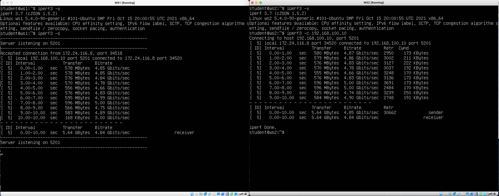

## Part 4. Сетевой экран

[Сетевой или межсетевой экран] "Что такое сетевой экран?" – это комплекс программных или аппаратных средств, которые
позволяют осуществлять фильтрацию и контроль проходящих через него пакетов в соответствии с заданными заранее
параметрами.
Основная задача межсетевого экрана – это защита компьютерных сетей или конкретных узлов от доступа злоумышленников.
Межсетевые экраны часто называют фильтрами, что связанно с их основной задачей – фильтровать пакеты, которые не подходят
под критерии, определенные в конфигурации.

### 4.1. Утилита iptables

**iptables** — это утилита брандмауэра командной строки, которая использует цепочки политик для разрешения или
блокировки трафика. Когда соединение пытается установиться в системе, ` iptables ` ищет правило в своем списке, чтобы
сопоставить его. Если утилита не находит нужного правила, она прибегает к действию по умолчанию.

Подсистема ` iptables ` и Netfilter уже достаточно давно встроена в ядро Linux. Все сетевые пакеты, которые проходят
через компьютер, отправляются компьютером или предназначены компьютеру, ядро направляет через фильтр ` iptables `. Там
эти пакеты поддаются проверкам и затем для каждой проверки, если она пройдена выполняется указанное в ней действие.
Например, пакет передается дальше ядру для отправки целевой программе, или отбрасывается.

Переходим в кореневой каталог

> ` cd `

Создаем файл ` /etc/firewall.sh `, имитирующий фаерволл, на ` ws1 ` и ` ws2 ` с помощью команды

> ` sudo touch /etc/firewall.sh `

Добавляем в файл следующие правила согласно задания:

> ` sudo vim /etc/firewall.sh `

1) на ` ws1 ` применить стратегию когда в начале пишется запрещающее правило, а в конце пишется разрешающее правило (это
   касается пунктов 4 и 5).

2) на ` ws2 ` применить стратегию когда в начале пишется разрешающее правило, а в конце пишется запрещающее правило (это
   касается пунктов 4 и 5).

3) открыть на машинах доступ для порта 22 (ssh) и порта 80 (http).

4) запретить *echo reply* (машина не должна "пинговаться”, т.е. должна быть блокировка на OUTPUT).

5) разрешить *echo reply* (машина должна "пинговаться").

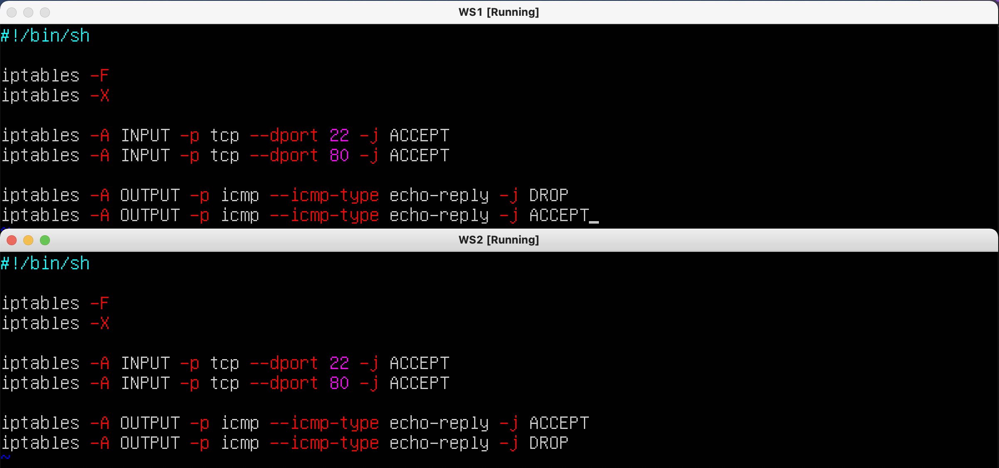

Запустим файлы на обеих машинах командами

> ` sudo chmod +x /etc/firewall.sh `

> ` sudo bash /etc/firewall.sh `

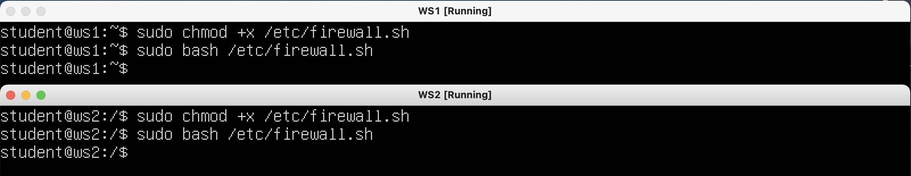

Разница между стратегиями, применёнными в первом и втором файлах, заключается в следующем: в утилите ` iptables `
правила выполняются сверху вниз.
На первой машине первым указано запрещающее правило на выход, поэтому она не сможет пропинговать другую машину. У второй
машины, наоброт - первым указано разрешающее правило, значит она сможет пропинговать другую машину.

Пропингуем соединение между машинами

### 4.2. Утилита nmap

**nmap** - это очень популярный сканер сети, для исследования сети и аудита безопасности. Он имеет открытый исходный
код, который может использоваться как в Windows, так и в Linux.

Эта программа помогает системным администраторам очень быстро понять какие компьютеры подключены к сети, узнать их
имена, а также посмотреть какое программное обеспечение на них установлено, какая операционная система и какие типы
фильтров применяются.

Этот инструмент обычно используется хакерами и энтузиастами кибербезопасности, а также сетевыми и системными
администраторами.
Он используется для следующих целей:

- информация о сети в режиме реального времени;
- подробная информация обо всех IP-адресах, активированных в вашей сети;
- количество открытых портов в сети;
- предоставить список живых хостов;
- сканирование портов, ОС и хостов;
- посмотреть типы применямых фильтров.
  Например, с помощью скриптов можно автоматически обнаруживать новые уязвимости безопасности в сети.
  Чаще всего ` nmap ` используется для сканирования системы по имени хоста или IP-адресу.
  Одной из особенностей ` nmap ` является то, что эта утилита может определить, включен ли хост, даже если его нельзя
  пропинговать.

#### 4.2.1 Поиск машины, которая не "пингуется"

> ` ping -c 5 172.24.116.8 `
>
> ` ping -c 5 192.168.100.10 `

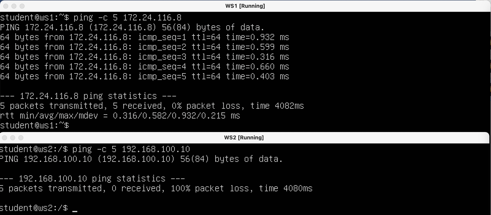

В файле ` firewall.sh ` для первой машины первым было указано запрещающее правило, поэтому она не пингуется. Для
проверки того чтобы показать, что хост машины запущен воспользуемся утилитой ` nmap `.
Установим утилиту ` nmap ` с помощью следующей команды. Во время установки появится запрос, нужно будет согласиться.

> ` sudo apt install nmap `

Запускаем утилиту ` nmap ` командой (для проверки ищем в выводе ` nmap ` наличие строки ***Host is up***)

> ` sudo nmap IP-address `

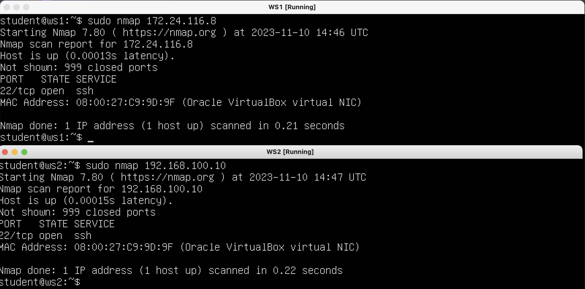

#### 4.2.2 Сохраняем дампы образов виртуальных машин.

Для [сохранения образов машины](https://comphome.ru/virtualbox-virtualnaja-mashina/kak-sohranit-sostojanie-virtualnoj-mashiny-virtualbox.html "Как сохранить состояние VM в VirtualBox")
в настройках машины выбираем *Опции - Снимки*.

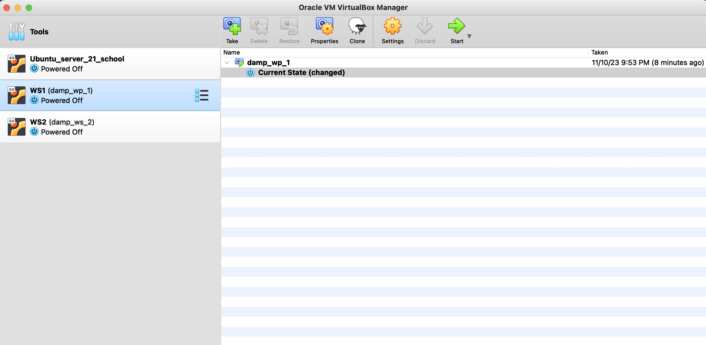
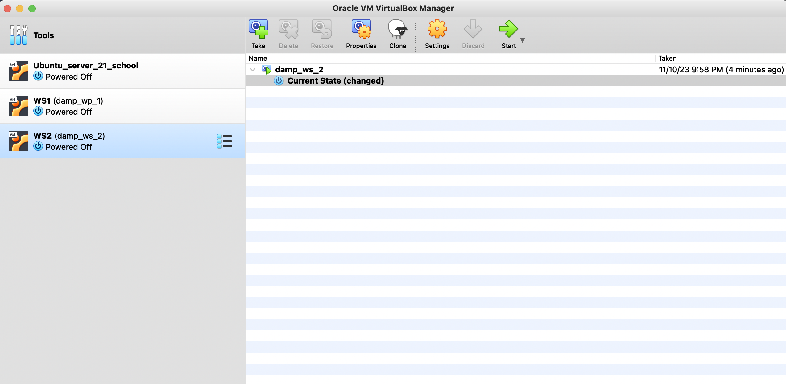

## Part 5. Статическая маршрутизация сети

Поднимаем пять виртуальных машин (3 рабочие станции (ws11, ws21, ws22) и 2 роутера (r1, r2))
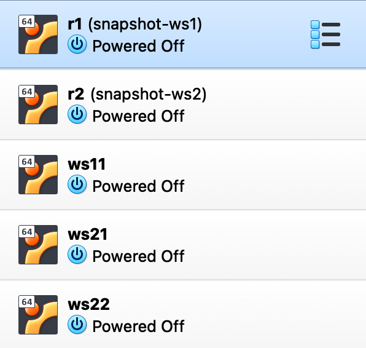

### 1. Настройка адресов машин

Настроить конфигурации машин в etc/netplan/00-installer-config.yaml согласно сети на рисунке:  

- содержание файла `etc/netplan/00-installer-config.yaml` для машины **ws11**:  
  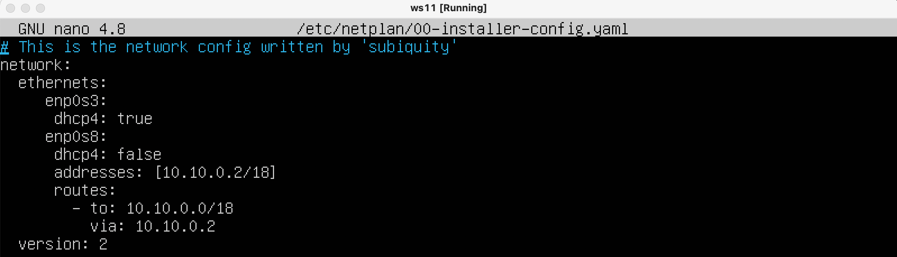
- содержание файла `etc/netplan/00-installer-config.yaml` для машины **r1**:  
  
- содержание файла `etc/netplan/00-installer-config.yaml` для машины **r2**:  
  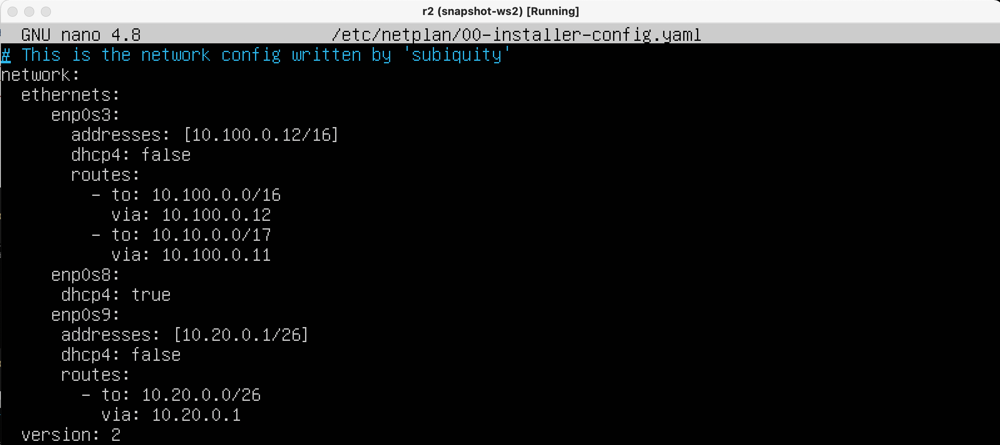 [Title](LinuxNetwork_report.md)
- содержание файла `etc/netplan/00-installer-config.yaml` для машины **ws21**:  
  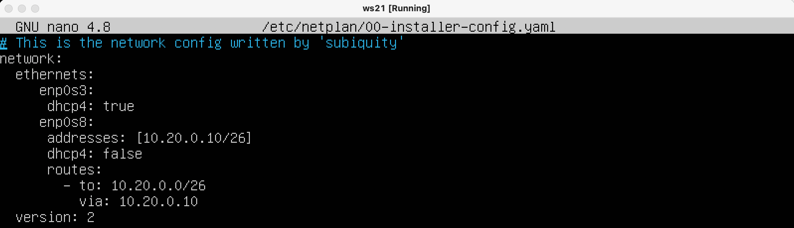
- содержание файла `etc/netplan/00-installer-config.yaml` для машины **ws22**:    
  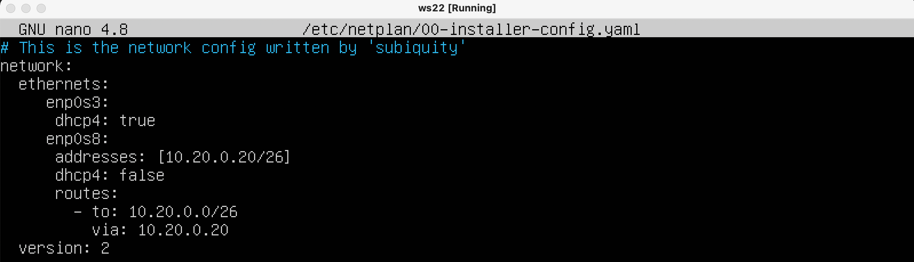

Перезапустим сервис сети и командой `ip -4 a` проверим, что адрес машины задан верно:

- машина **ws11**:  
  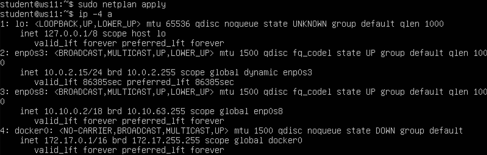
- машина **r1**:  
  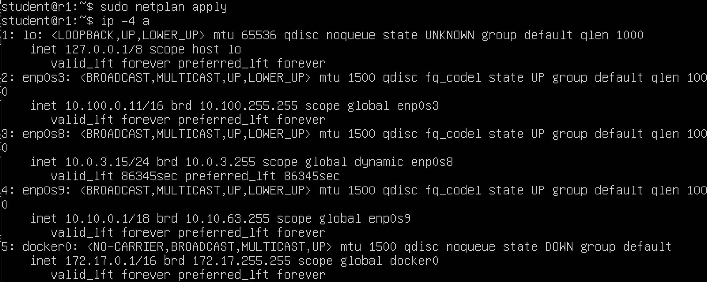
- машина **r2**:  
  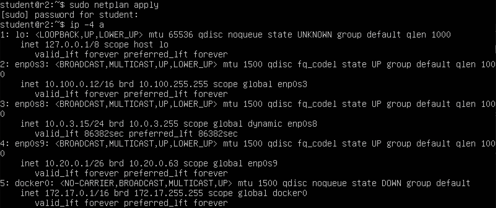
- машина **ws21**:  
  
- машина **ws22**:  
  

Пропингуем  **ws22** с **ws21**:  

Аналогично пропингуем **r1** с **ws11**:

### 2. Включение переадресации IP-адресов

Для включения переадресации IP, выполните команду на роутерах `sysctl -w net.ipv4.ip_forward=1`

- роутер **r1**:  
  
- роутер **r**:  
  

Далее откроем файл `/etc/sysctl.conf` и добавьте в него следующую строку: **net.ipv4.ip_forward = 1**

- роутер **r1**:  
  
- роутер **r2**:  
  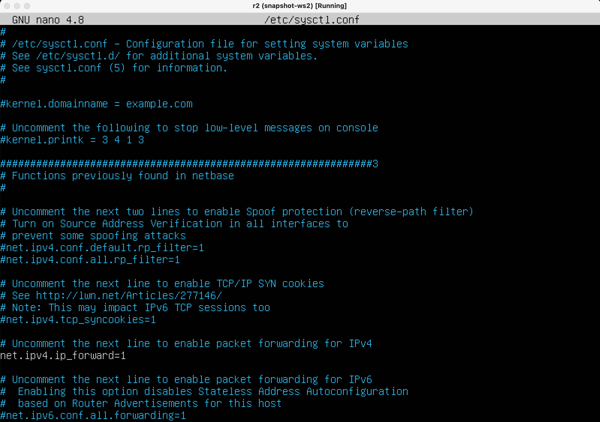

### 3. Установка маршрута по-умолчанию

Настроим маршрут по-умолчанию (шлюз) для рабочих станций  
Для этого добавить **default** перед IP роутера в файле конфигураций

- машина **ws11**:  
  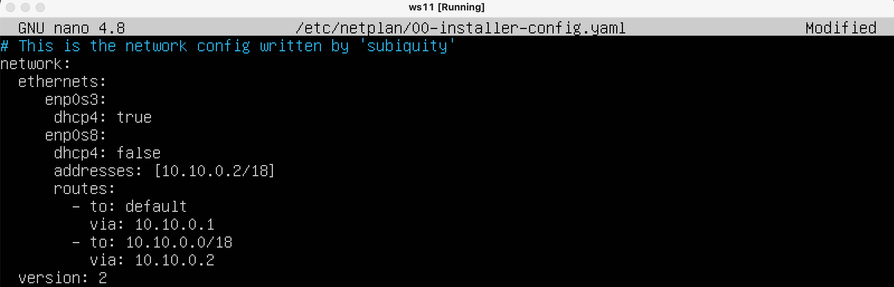
- машина **ws21**:  
  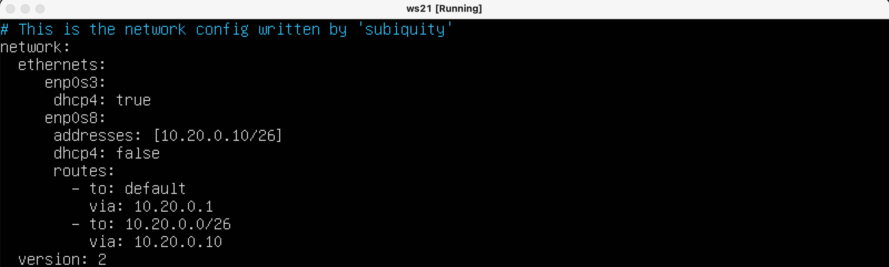
- машина **ws22**:  
  

Вызваем `ip r`, чтобы показать, что добавился маршрут в таблицу маршрутизации:

- машина **ws11**:  
  
- машина **ws21**:  
  
- машина **ws22**:  
  

Пропингуем с машины **ws11** роутер **r2**:  
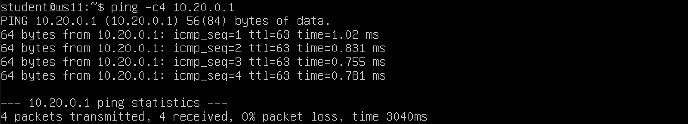  
Для того, чтобы проверить, что пинг проходит используем команду: `sudo tcpdump -tn -i enp0s9 -c4`  

### 4. Добавление статических маршрутов

Добавим в роутеры r1 и r2 статические маршруты в файле конфигураций:

- роутер **r1**:  
  
- роутер **r1**:  
  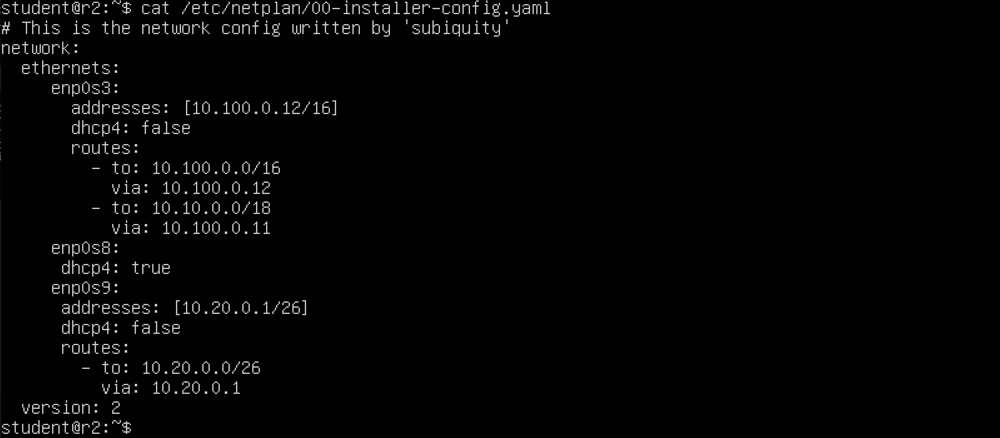

Вызываем `ip r`, чтобы показать таблицы с маршрутами на обоих роутерах:

- роутер **r1**:  
  
- роутер **r1**:  
  

Запустим команды на ws11: `ip r list 10.10.0.0/[маска сети]` и `ip r list 0.0.0.0/0`:  
  
Для адреса 10.10.0.0/18 был выбран маршрут, отличный от 0.0.0.0/0, хотя он попадает под маршрут по-умолчанию, потому что
роутер считает маршруты с наибольшей маской более приоритетными, таким образом маршрут с маской /0 - самый последний по
приоритету

### 5. Построение списка маршрутизаторов

Запустим на **r1** команду дампа: `tcpdump -tnv -i enp0s9`  
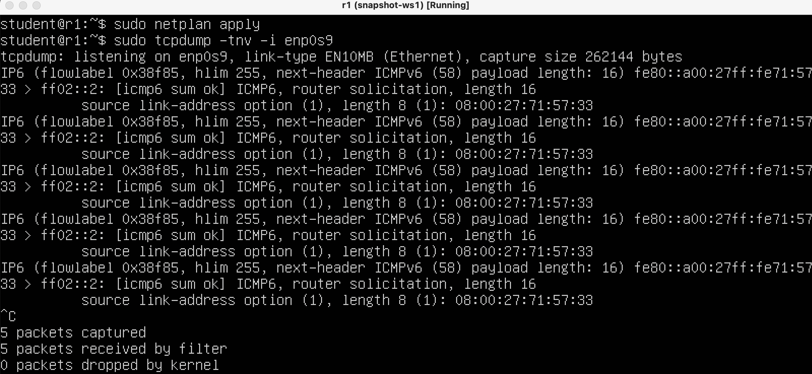  
При помощи команды `sudo traceroute 10.20.0.10` построим список маршрутизаторов на пути от **ws11** до **ws21**:  
  
Для определения промежуточных маршрутизаторов **traceroute** отправляет целевому узлу серию ICMP-пакетов (по умолчанию 3
пакета), с каждым шагом увеличивая значение поля TTL («время жизни») на 1. Первая серия пакетов отправляется с TTL,
равным 1, и поэтому первый же маршрутизатор возвращает обратно ICMP-сообщение «time exceeded in transit», указывающее на
невозможность доставки данных. Traceroute фиксирует адрес маршрутизатора, а также время между отправкой пакета и
получением ответа (эти сведения выводятся на монитор компьютера). Затем traceroute повторяет отправку серии пакетов, но
уже с TTL, равным 2, что заставляет первый маршрутизатор уменьшить TTL пакетов на единицу и направить их ко второму
маршрутизатору. Второй маршрутизатор, получив пакеты с TTL=1, так же возвращает «time exceeded in transit»

### 6. Использование протокола ICMP при маршрутизации

Запустить на **r1** перехват сетевого трафика, проходящего через eth0 с помощью
команды: `sudo tcpdump -n -i eth0s8 icmp`  
  
Пропингуем с **ws11** несуществующий IP (например, 10.30.0.111) с помощью команды: `ping -c4 10.30.0.111`  
  
Сохраним дампы образов виртуальных машин:  

## Part 6. Динамическая настройка IP с помощью DHCP

Для **r2** настроим в файле /etc/dhcp/dhcpd.conf конфигурацию службы DHCP:

- установим нужные нам утилиты, чтобы получить файл **dhcpd.conf**: `sudo apt install isc-dhcp-server`
  и `sudo apt install resolvconf`
- указываем адрес маршрутизатора по-умолчанию, DNS-сервер и адрес внутренней сети в файле /etc/dhcp/dhcpd.conf:  
  
- в файле resolv.conf прописать `nameserver 8.8.8.8`
  
- перезагрузим службу DHCP командой `sudo systemctl restart isc-dhcp-server`  
  
- машину **ws21** перезагрузим при помощи `reboot` и через `ip a` покажем, что она получила адрес:  
  
- пропингуем **ws22** с **ws21**:  
  

Укажем MAC адрес у **ws11**, для этого в etc/netplan/00-installer-config.yaml добавим
строки: `macaddress: 10:10:10:10:10:BA` и `dhcp4: true`:  
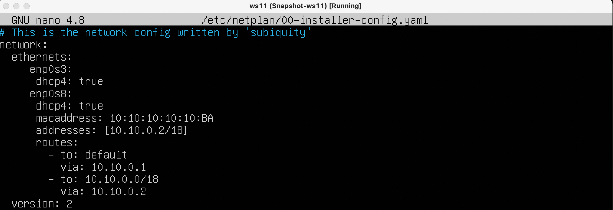  
Для **r1** аналогично настроим **r2**, но сделаем выдачу адресов с жесткой привязкой к MAC-адресу (ws11):

- установим DHCP на **r1** командой `sudo apt install isc-dhcp-server`
- отредактируем файл /etc/dhcp/dhcpd.conf на **r1**:  
  
- отредактируем файл resolv.conf на **r1**:  
  
- перезагрузим службу DHCP командой `sudo systemctl restart isc-dhcp-server`  
  
- перезагрузим **ws11** при помощи `reboot` и через `ip a` покажем, что она получила адрес:  
  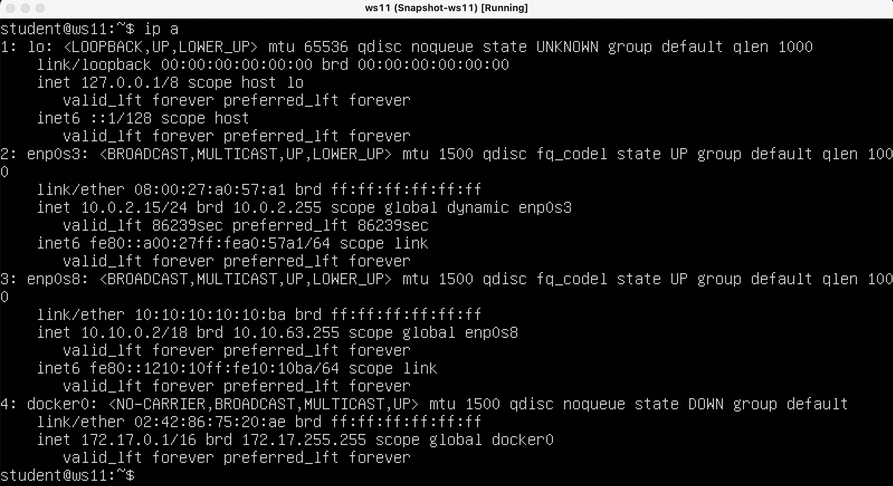
- в настройках машины **ws11** пропишем MAC Address:  
  
- проведём аналогичные тесты:  
  

Запросим с **ws21** обновление ip адреса:

- IP до обновления:  
  
- удаляем старые адреса `sudo dhclient -r` и получаем новые `sudo dhclient`  
  
- Опции **DHCP**, которые мы используем:
    - **subnet** – сеть, в которой будут работать настройки;
    - **netmask** - маска подсети;
    - **range** – диапазон IP-адресов;
    - **option routers** – шлюз по-умолчанию;
    - **option domain-name-servers** – DNS-сервера;
    - **host** - привязка к MAC-адресу

Сохраним дампы образов виртуальных машин:  
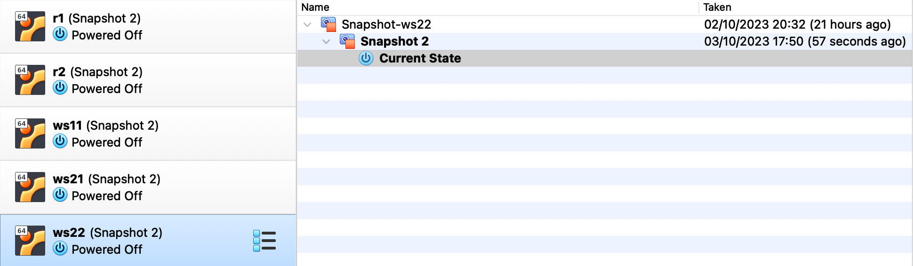

## Part 7. NAT

В файле /etc/apache2/ports.conf на и **r1** изменим строку `Listen 80` на `Listen 0.0.0.0:80`, то есть сделаем сервер
Apache2 общедоступным:

- роутер **r1**  
  
- машина **ws22**  
  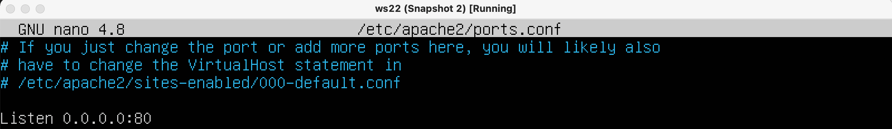

Запустим веб-сервер Apache командой `service apache2 start` на **ws22** и **r1**:

- машина **ws22**
  
- роутер **r1**  
  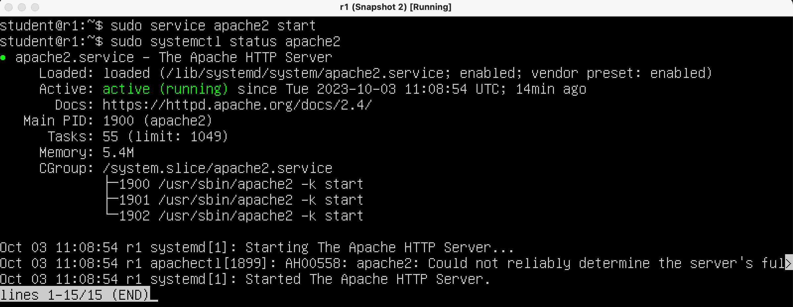

Добавляем в фаервол, созданный по аналогии с фаерволом из Части 4, на **r2** следующие правила:

1) Удаление правил в таблице `filter - iptables -F`
2) Удаление правил в таблице "NAT" - `iptables -F -t nat`
3) Отбрасывать все маршрутизируемые пакеты - `iptables --policy FORWARD DROP`

  
Запускаем и проверяем:  

Проверить соединение между **ws22** и **r1** командой `ping`. При запуске файла с этими правилами, **ws22** не должна "
пинговаться" с **r1**:  
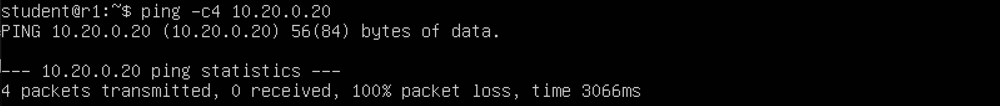  
Добавить в файл ещё одно правило:

4. разрешить маршрутизацию всех пакетов протокола ICMP:
   

Запустим и проверим:  
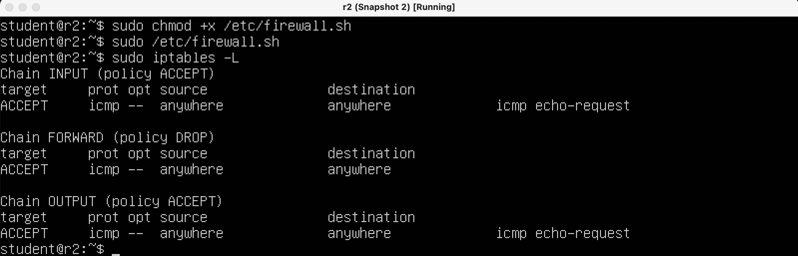  
Проверить соединение между **ws22** и **r1** командой `ping`. При запуске файла с этими правилами, **ws22** должна "
пинговаться" с **r1**:
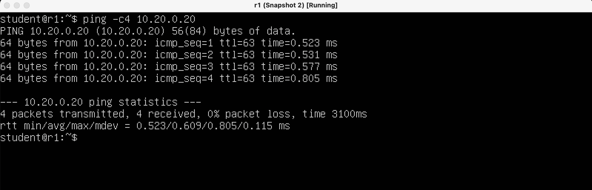
Добавим в файл ещё два правила:

5. Включить **SNAT**, а именно маскирование всех локальных ip из локальной сети, находящейся за **r2** (по обозначениям
   из Части 5 - сеть 10.20.0.0)

6. Включить **DNAT** на 8080 порт машины **r2** и добавить к веб-серверу Apache, запущенному на **ws22**, доступ извне
   сети  
   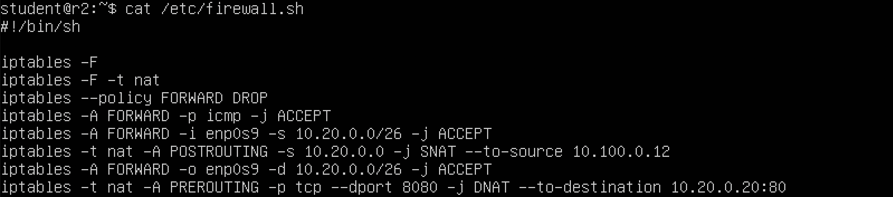

И запустим систему:

Отключаем сетевой интерфейс **NAT** (проверяем командой `ip a`) в VirtualBox
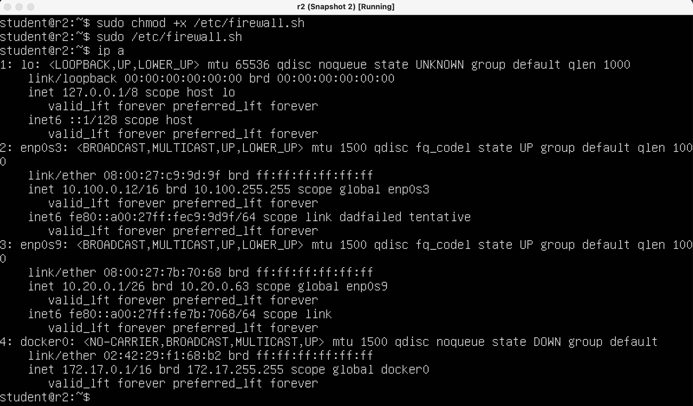
На скриншоте видно, что адаптера **enp0s8**, который отвечал за интернет, нет

Проверяем соединение по TCP для SNAT, для этого с **ws22** подключиться к серверу Apache на **r1** командой:
`telnet [адрес] [порт]`

Проверить соединение по TCP для DNAT, для этого с **r1** подключиться к серверу Apache на **ws22** командой `telnet` (
обращаться по адресу **r2** и порту 8080)

## Part 8. Дополнительно. Знакомство с SSH Tunnels

Запустим на **r2** фаервол с правилами из Части 7:  
  
Воспользуемся Local TCP forwarding с **ws21** до **ws22**, чтобы получить доступ к веб-серверу на **ws22** с **ws21
** `sudo ssh -L 8080:localhost:80 student@10.20.0.20`:  
  
Воспользуемся Remote TCP forwarding c **ws11** до **ws22**, чтобы получить доступ к веб-серверу на **ws22** с **ws11
** `sudo ssh -R 8080:localhost:80 student@10.20.0.20`:  
  
Для проверки, сработало ли подключение в обоих предыдущих пунктах, перейдите во второй терминал (например, клавишами
fn + option + F2) и выполните команду:
`telnet 127.0.0.1 [локальный порт]`  
